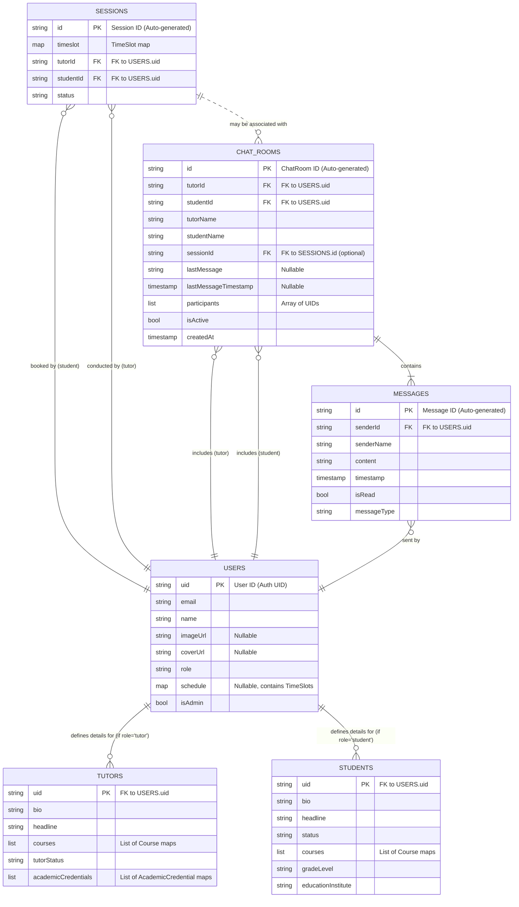

# Domain Layer Documentation

## Overview

The Domain Layer is a crucial part of the application's core, responsible for managing the business logic and data entities. It primarily consists of:

1.  **Data Layer Services & Schema:** This refers to the external backend services (like Firebase) and the defined structure (schema) of how data is organized and stored within those services, particularly Firestore.
2.  **Domain Models:** These are the Dart classes that represent the core entities and value objects of the application (e.g., `User`, `Session`, `Tutor`), mirroring the Firestore schema.
3.  **Repositories:** These act as intermediaries between the application's use cases (often driven by BLoCs or Cubits in the feature layers) and the data sources, providing a clean API to interact with the domain models and abstracting the direct interaction with the Data Layer Services.

This document details these components, outlining their responsibilities and interactions.

---

## Entity Relationships and Firestore Schema

This section describes the structure of data as it's stored in Firebase Firestore, inferred from your Dart domain models. It also explains the relationships between these data entities.

### Firestore Collections and Schema

Based on the provided Dart models, the anticipated Firestore schema is as follows:

* **`users` Collection:**
    * **Document ID:** `uid` (matches Firebase Authentication UID)
    * **Purpose:** Stores general information applicable to all users, regardless of their role. This centralized approach avoids data duplication for common attributes.
    * **Fields:**
        * `email`: (String) User's email address.
        * `name`: (String) User's full name.
        * `imageUrl`: (String, nullable) URL to the user's profile picture.
        * `coverUrl`: (String, nullable) URL to the user's cover image.
        * `role`: (String) The user's role (e.g., "tutor", "student", "unknown").
        * `schedule`: (Map, nullable) Represents the `Schedule` model, storing `year` (int), `month` (int), and `slots` (List of `TimeSlot` maps, where each `TimeSlot` map contains `start` and `end` as ISO DateTime strings).
        * `isAdmin`: (Boolean) Flag indicating if the user has administrative privileges.

* **`tutors` Collection:**
    * **Document ID:** `uid` (matches the `uid` in the `users` collection for a user with the 'tutor' role).
    * **Purpose:** Stores profile information specific to users who are tutors.
    * **Fields:**
        * `uid`: (String) Primary key, same as the user's auth UID.
        * `bio`: (String) A short biography of the tutor.
        * `headline`: (String) A catchy headline for the tutor's profile.
        * `courses`: (List of Maps) Each map represents a `Course` model (e.g., `{"subjectType": "math", "generalLevel": "ten"}`).
        * `tutorStatus`: (String) e.g., "active", "inactive".
        * `academicCredentials`: (List of Maps) Each map represents an `AcademicCredential` model.

* **`students` Collection:**
    * **Document ID:** `uid` (matches the `uid` in the `users` collection for a user with the 'student' role).
    * **Purpose:** Stores profile information specific to users who are students.
    * **Fields:**
        * `uid`: (String) Primary key, same as the user's auth UID.
        * `bio`: (String) A short biography of the student.
        * `headline`: (String) A profile headline for the student.
        * `status`: (String) e.g., "active", "inactive".
        * `courses`: (List of Maps) Each map represents a `Course` model the student is interested in.
        * `gradeLevel`: (String) The student's current grade (e.g., "ten", "undergraduate").
        * `educationInstitute`: (String) The name of the student's educational institution.

* **`sessions` Collection:**
    * **Document ID:** Auto-generated by Firestore.
    * **Purpose:** Represents scheduled tutoring sessions.
    * **Fields:**
        * `id`: (String) Copy of the Firestore document ID.
        * `timeslot`: (Map) Represents the `TimeSlot` model (e.g., `{"start": "ISO_DATETIME_STRING", "end": "ISO_DATETIME_STRING", "name": "Optional Name"}`).
        * `tutorId`: (String) UID of the tutor (references `users.uid`).
        * `studentId`: (String) UID of the student (references `users.uid`).
        * `status`: (String) e.g., "scheduled", "completed".

* **`chatRooms` Collection:**
    * **Document ID:** Auto-generated by Firestore.
    * **Purpose:** Represents a dedicated chat channel.
    * **Fields:**
        * `id`: (String) Copy of the Firestore document ID.
        * `tutorId`: (String) UID of the tutor participant.
        * `studentId`: (String) UID of the student participant.
        * `tutorName`: (String) Denormalized name of the tutor.
        * `studentName`: (String) Denormalized name of the student.
        * `sessionId`: (String, nullable) ID of the `Session` this chat is linked to (references `sessions.id`).
        * `lastMessage`: (String, nullable) Content of the last message.
        * `lastMessageTimestamp`: (Timestamp, nullable) Timestamp of the last message.
        * `participants`: (List of Strings) Array containing `tutorId` and `studentId` for querying.
        * `isActive`: (Boolean)
        * `createdAt`: (Timestamp)
    * **Subcollection: `messages`**
        * **Document ID:** Auto-generated by Firestore.
        * **Purpose:** Stores individual messages within a `ChatRoom`.
        * **Fields:**
            * `id`: (String) Copy of the Firestore document ID.
            * `senderId`: (String) UID of the message sender.
            * `senderName`: (String) Denormalized name of the sender.
            * `content`: (String) Message text.
            * `timestamp`: (Timestamp)
            * `isRead`: (Boolean)
            * `messageType`: (String) e.g., "text".

### Entity Relationship Diagram (ERD - Conceptual)

This diagram illustrates the relationships between the main Firestore collections.

### Design Rationale and Key Structures

* **Separation of Authentication and User Profile (`AuthCredential` vs. `User` model):**
    * Firebase Authentication handles the actual authentication process (verifying credentials, issuing tokens). The `AuthCredential` model in your Dart code likely represents the data directly from Firebase Auth (like UID, email from provider).
    * The `users` collection in Firestore (represented by your `User` Dart model) stores your application-specific user profile. This profile is created *after* successful authentication and can include much richer information (custom name, roles, application-specific settings, profile picture URLs managed by your app's storage, `Schedule` data, etc.) than what Firebase Auth typically stores.
    * **Why separate?**
        * **Flexibility:** Your application's user profile can evolve independently of Firebase Auth's user object.
        * **Rich Data:** You can store complex, structured data related to a user that doesn't fit into the standard Firebase Auth user properties.
        * **Security:** Keeps sensitive application data separate from the primary authentication record.

* **Separation of General User Profile (`users`) from Role-Specific Profiles (`tutors`, `students`):**
    * The `users` collection holds data common to *all* users (e.g., `name`, `email`, `role`, `imageUrl`, `schedule`).
    * `tutors` and `students` collections store data unique to each role. They are linked to the `users` collection via the shared `uid`.
    * **Why separate?**
        * **Data Integrity & Relevance:** Avoids having many nullable fields in a single "uber-profile" collection. A student document won't have fields like `academicCredentials`, and a tutor document won't have `gradeLevel` (as a student property).
        * **Scalability & Query Performance:** Queries for role-specific information can be targeted directly at the relevant collection.
        * **Clearer Model:** Makes the domain models (`User`, `Tutor`, `Student` in Dart) cleaner and more focused.

* **Shared Properties in `User` Collection (Profile Pictures, Schedule):**
    * Attributes like `imageUrl`, `coverUrl`, and `schedule` are placed in the `users` collection because they are considered common functionalities that any user might utilize, regardless of their primary role as a tutor or student.
    * For instance, both tutors and students have a profile picture. A tutor's `schedule` represents their availability, while a student's `schedule` might reflect their booked sessions or general study availability.
    * Placing these in `users` centralizes common data, reducing redundancy and simplifying updates to these shared aspects.

* **`TimeSlot` Structure and `Schedule` Model:**
    * A `TimeSlot` is defined by a `start` and `end` `DateTime`. This is a fundamental representation for any schedulable block of time.
    * The `Schedule` model (stored as a map within a `User` document) groups a list of these `TimeSlot`s, typically organized by `year` and `month`.
    * **Benefits:**
        * **Availability Checking:** When a student wants to book a session, the system can fetch the tutor's `schedule` (list of available `TimeSlot`s) for the relevant period. Checking if a requested time overlaps with existing `TimeSlot`s becomes a straightforward comparison.
        * **Sorting & Display:** A list of `TimeSlot`s can be easily sorted by their `start` time, which is essential for displaying available slots or booked sessions chronologically.
        * **Conflict Detection:** The `overlaps` method in your `TimeSlot` Dart model is crucial for preventing double bookings or scheduling conflicts.
        * **Granularity:** This structure allows for precise time management. While your current implementation might focus on hourly slots, the `start` and `end` `DateTime`s can represent any duration.
        * **Firestore Storage:** Storing `DateTime`s as ISO strings or Firestore Timestamps within the `TimeSlot` map is standard and allows for date-based queries (though complex overlap queries directly in Firestore are limited).

* **`ChatRoom` and `Messages` Subcollection:**
    * A `ChatRoom` document establishes a unique conversation channel between two users (identified by `tutorId` and `studentId`). The `participants` array (containing both UIDs) is vital for Firestore queries like "find all chat rooms where `currentUser.uid` is in `participants`".
    * `Messages` are stored as a subcollection under their respective `ChatRoom` document. This is a highly recommended Firestore pattern for one-to-many relationships where the "many" side (messages) can grow large.
    * **Benefits:**
        * **Scalability:** Chat rooms can have many messages without making the `ChatRoom` document itself too large (Firestore documents have a 1MB size limit).
        * **Query Efficiency:** When fetching messages for a specific chat, you only query that chat's `messages` subcollection, which is much more efficient than querying a global `messages` collection and filtering by `chatRoomId`.

This schema design aims to balance data normalization (reducing redundancy) with denormalization (e.g., `tutorName`, `studentName` in `ChatRoom` for faster reads) to support common query patterns and application features efficiently.

---

## Data Layer Services (External Dependencies)

The repositories in the domain layer interact with several external backend services to persist and retrieve data, handle authentication, and manage file storage. These services form the actual data layer that the repositories abstract.

### `Firebase Firestore`

* **Purpose:** A NoSQL document database used for storing and syncing data in real-time.
* **Usage by Repositories:**
    * `ChatRepository`: Stores `ChatRoom` and `Message` documents.
    * `SessionRepository`: Stores `Session` documents.
    * `StudentRepository`: Stores `Student` profile documents.
    * `TutorRepository`: Stores `Tutor` profile documents.
    * `UserRepository`: Stores general `User` profile documents.
* **Key Interactions:** Creating, reading, updating, deleting documents (CRUD operations), and listening to real-time updates for collections.

### `Firebase Authentication`

* **Purpose:** Provides backend services for user authentication, supporting various sign-in methods.
* **Usage by Repositories:**
    * `AuthenticationRepository`: Manages user sign-up with email/password, sign-in with email/password, sign-out, password reset, and listens to authentication state changes. It also handles credential management after social sign-ins (like Google).
* **Key Interactions:** User creation, sign-in, sign-out, token management, and auth state observation.

### `Firebase Storage`

* **Purpose:** Provides secure and scalable object storage for files like images, audio, or videos.
* **Usage by Repositories:**
    * `StorageRepository`: Manages uploading files (e.g., user profile images, academic credential scans) and retrieving their download URLs.
* **Key Interactions:** File uploads, obtaining download URLs.

### `Google Sign-In`

* **Purpose:** A specific authentication provider that allows users to sign in using their Google accounts.
* **Usage by Repositories:**
    * `AuthenticationRepository`: Integrates with the Google Sign-In SDK to initiate the Google authentication flow and then uses the obtained credentials to sign the user into Firebase Authentication.
* **Key Interactions:** Initiating Google sign-in flow, obtaining Google user credentials (ID token, access token).

---

## Domain Models (`lib/core/models/`)

This section describes the primary data structures (models) used throughout the application. These models define the entities and value objects that the application manipulates and stores.

### `AcademicCredential`

* **Purpose:** Represents an academic qualification or achievement of a tutor.
* **Key Attributes:** `institution` (String), `level` (AcademicCredentialLevel enum), `fieldOfStudy` (String), `focus` (String), `dateIssued` (DateTime), `imageUrl` (String - for a scanned copy).
* **Related Enum:** `AcademicCredentialLevel` (highschool, certificate, diploma, bachelor, masters, doctorate).

### `AppMode`

* **Purpose:** An enum to define the operational mode of the application, distinguishing between standard user access and administrative functionalities.
* **Values:** `admin`, `user`.

### `AuthCredential`

* **Purpose:** Represents the authentication credentials of a user, primarily obtained from Firebase Authentication.
* **Key Attributes:** `id` (String - user's unique ID), `email` (String?).

### `ChatRoom`

* **Purpose:** Represents a conversation session between two users (typically a tutor and a student).
* **Key Attributes:** `id` (String), `tutorId` (String), `studentId` (String), `tutorName` (String), `studentName` (String), `sessionId` (String - related tutoring session), `lastMessage` (String?), `lastMessageTimestamp` (DateTime?), `unreadCount` (int), `isActive` (bool), `createdAt` (DateTime), `participants` (`List<String>`).

### `Course`

* **Purpose:** Represents a subject at a specific grade level that a tutor can teach or a student needs help with.
* **Key Attributes:** `subjectType` (Subject enum), `generalLevel` (Grade enum).

### `Grade`

* **Purpose:** An enum representing academic grade levels.
* **Values:** `unknown`, `ten`, `eleven`, `twelve`, `undergraduate`, `graduate`. Includes comparison operators.

### `Message`

* **Purpose:** Represents a single message within a `ChatRoom`.
* **Key Attributes:** `id` (String), `chatRoomId` (String), `senderId` (String), `senderName` (String), `content` (String), `timestamp` (DateTime), `isRead` (bool), `messageType` (MessageType enum).
* **Related Enum:** `MessageType` (text, image, file, system).

### `Schedule`

* **Purpose:** Represents a user's availability or booked slots for a specific month and year.
* **Key Attributes:** `year` (int), `month` (Month enum), `slots` (`List<TimeSlot>`).
* **Related Enum:** `Month` (january to december).

### `Session`

* **Purpose:** Represents a scheduled tutoring session between a tutor and a student.
* **Key Attributes:** `id` (String), `timeslot` (TimeSlot?), `tutorId` (String), `studentId` (String), `status` (SessionStatus enum).

### `SessionListFilter`

* **Purpose:** A value object used to filter the list of sessions.
* **Key Attributes:** `selectedDate` (DateTime?), `statuses` (`Set<SessionStatus>`), `searchStrings` (`Set<String>`).

### `SessionStatus`

* **Purpose:** An enum representing the current status of a `Session`.
* **Values:** `scheduled`, `inProgress`, `completed`, `cancelled`.

### `Student`

* **Purpose:** Represents a user with the role of a student. Contains student-specific profile information.
* **Key Attributes:** `uid` (String), `bio` (String), `headline` (String), `status` (StudentStatus enum), `courses` (`List<Course>`), `gradeLevel` (Grade enum), `educationInstitute` (String).
* **Related Enum:** `StudentStatus` (active, inactive).

### `Subject`

* **Purpose:** An enum representing academic subjects.
* **Values:** `math`, `science`, `english`, `chemistry`, `physics`, `biology`, `socialStudies`.

### `TimeSlot`

* **Purpose:** Represents a specific block of time, typically an hour, defined by a start and end `DateTime`.
* **Key Attributes:** `id` (String?), `name` (String?), `start` (DateTime), `end` (DateTime).

### `Tutor`

* **Purpose:** Represents a user with the role of a tutor. Contains tutor-specific profile information.
* **Key Attributes:** `uid` (String), `bio` (String), `headline` (String), `courses` (`List<Course>`), `tutorStatus` (TutorStatus enum), `academicCredentials` (`List<AcademicCredential>`).
* **Related Enum:** `TutorStatus` (active, inactive).

### `User`

* **Purpose:** Represents a general user in the system, containing common profile information.
* **Key Attributes:** `email` (String), `name` (String), `imageUrl` (String?), `coverUrl` (String?), `role` (UserRole enum), `schedule` (Schedule?), `isAdmin` (bool).

### `UserRole`

* **Purpose:** An enum representing the role of a user within the application.
* **Values:** `tutor`, `student`, `unknown`.

---

## Repositories (`lib/core/repositories/`)

This section details each repository, outlining its responsibilities, the services it depends on (see Section under "Data Layer Services"), the domain models it manages (see Section under "Domain Models"), and its public interface.

### `AuthenticationRepository`

Handles all aspects of user authentication, including sign-up, sign-in, sign-out, and password management.

* **Services Used:**
    * `Firebase Authentication`
    * `Google Sign-In`
* **Concerned Domain Models:**
    * `AuthCredential`
* **Public Methods:**
    * `get credential`: `Stream<AuthCredential>` - Provides a stream of the current authentication credential, emitting new values upon authentication state changes.
    * `get currentCredential`: `AuthCredential` - Synchronously retrieves the currently cached authentication credential.
    * `signUp({required String email, required String password})`: `Future<void>` - Creates a new user account using email and password.
    * `logInWithGoogle()`: `Future<void>` - Initiates the Google Sign-In flow and authenticates the user with Firebase.
    * `logInWithEmailAndPassword({required String email, required String password})`: `Future<void>` - Signs in an existing user with their email and password.
    * `logOut()`: `Future<void>` - Signs out the currently authenticated user from both Firebase and Google Sign-In if applicable.
    * `resetPassword({required String email})`: `Future<void>` - Sends a password reset email to the provided email address.

---

### `ChatRepository`

Manages operations related to chat rooms and messages, including sending messages, creating chat rooms, and retrieving chat history.

* **Services Used:**
    * `Firebase Firestore`
* **Concerned Domain Models:**
    * `Message`
    * `ChatRoom`
* **Public Methods:**
    * `sendMessage(String chatRoomId, Message message)`: `Future<void>` - Adds a new message to the specified chat room and updates the chat room's last message details.
    * `createChatRoom(ChatRoom chatRoom)`: `Future<String>` - Creates a new chat room document in Firestore and returns its ID.
    * `getChatRoom(String chatRoomId)`: `Future<ChatRoom?>` - Retrieves a specific chat room by its ID.
    * `markMessagesAsRead(String chatRoomId, String userId)`: `Future<void>` - Updates the `isRead` status of messages in a chat room for a given user.
    * `getMessages(String chatRoomId)`: `Future<List<Message>>` - Fetches all messages for a specific chat room, ordered by timestamp.

---

### `SessionRepository`

Handles data operations for tutoring sessions, such as fetching session lists, creating new sessions, and retrieving details for a specific session.

* **Services Used:**
    * `Firebase Firestore`
* **Concerned Domain Models:**
    * `Session`
    * `TimeSlot`
    * `SessionStatus`
* **Public Methods:**
    * `getSessions()`: `Stream<List<Session>>` - Returns a stream of all sessions, allowing real-time updates.
    * `create(Session session)`: `Future<void>` - Adds a new session document to Firestore.
    * `getSessionById(String sessionId)`: `Future<Session?>` - Retrieves a specific session by its unique ID.

---

### `StorageRepository`

Manages file uploads to cloud storage, primarily used for user profile images or other media.

* **Services Used:**
    * `Firebase Storage`
* **Concerned Domain Models:**
    * None directly. Deals with file paths (String) and download URLs (String).
* **Public Methods:**
    * `uploadFile(String userId, String filePath)`: `Future<String>` - Uploads a file from the local `filePath` to a user-specific path in Firebase Storage and returns the public download URL. Returns an empty string if `filePath` is empty.

---

### `StudentRepository`

Manages data operations specific to student profiles.

* **Services Used:**
    * `Firebase Firestore`
* **Concerned Domain Models:**
    * `Student`
* **Public Methods:**
    * `createStudent(String uid, Student student)`: `Future<void>` - Creates a new student profile document in Firestore, identified by the user's UID.
    * `getStudent(String uid)`: `Future<Student?>` - Retrieves a specific student's profile by their UID.

---

### `TutorRepository`

Manages data operations specific to tutor profiles.

* **Services Used:**
    * `Firebase Firestore`
* **Concerned Domain Models:**
    * `Tutor`
* **Public Methods:**
    * `createTutor(String uid, Tutor tutor)`: `Future<void>` - Creates a new tutor profile document in Firestore, identified by the user's UID.
    * `getTutors()`: `Future<List<Tutor>>` - Retrieves a list of all tutor profiles.
    * `getTutor(String uid)`: `Future<Tutor?>` - Retrieves a specific tutor's profile by their UID.

---

### `UserRepository`

Handles general user data operations, such as creating, retrieving, updating, and deleting user profiles that are common to all user roles.

* **Services Used:**
    * `Firebase Firestore`
* **Concerned Domain Models:**
    * `User`
    * `UserRole`
    * `Schedule`
* **Public Methods:**
    * `createUser(String uid, User user)`: `Future<void>` - Creates a new user document in Firestore, associated with the provided UID.
    * `getUser(String uid)`: `Future<User>` - Retrieves a user document by UID. Returns `User.empty` if not found.
    * `updateUser(String uid, User user)`: `Future<void>` - Updates an existing user document.
    * `updateUserRole(String uid, UserRole role)`: `Future<void>` - Specifically updates the `role` field of a user document.
    * `updateAdminStatus(String uid, bool isAdmin)`: `Future<void>` - Specifically updates the `isAdmin` field of a user document.
    * `deleteUser(String uid)`: `Future<void>` - Deletes a user document by UID.
    * `getUsers()`: `Future<List<User>>` - Retrieves a list of all user documents.
