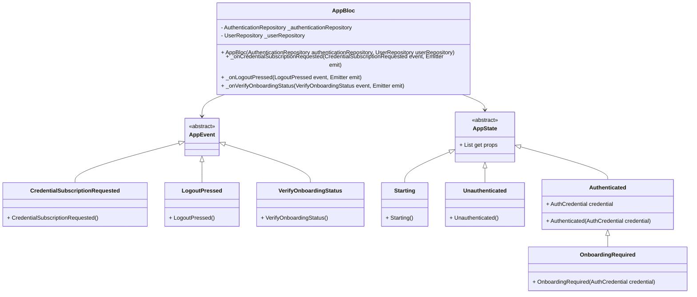
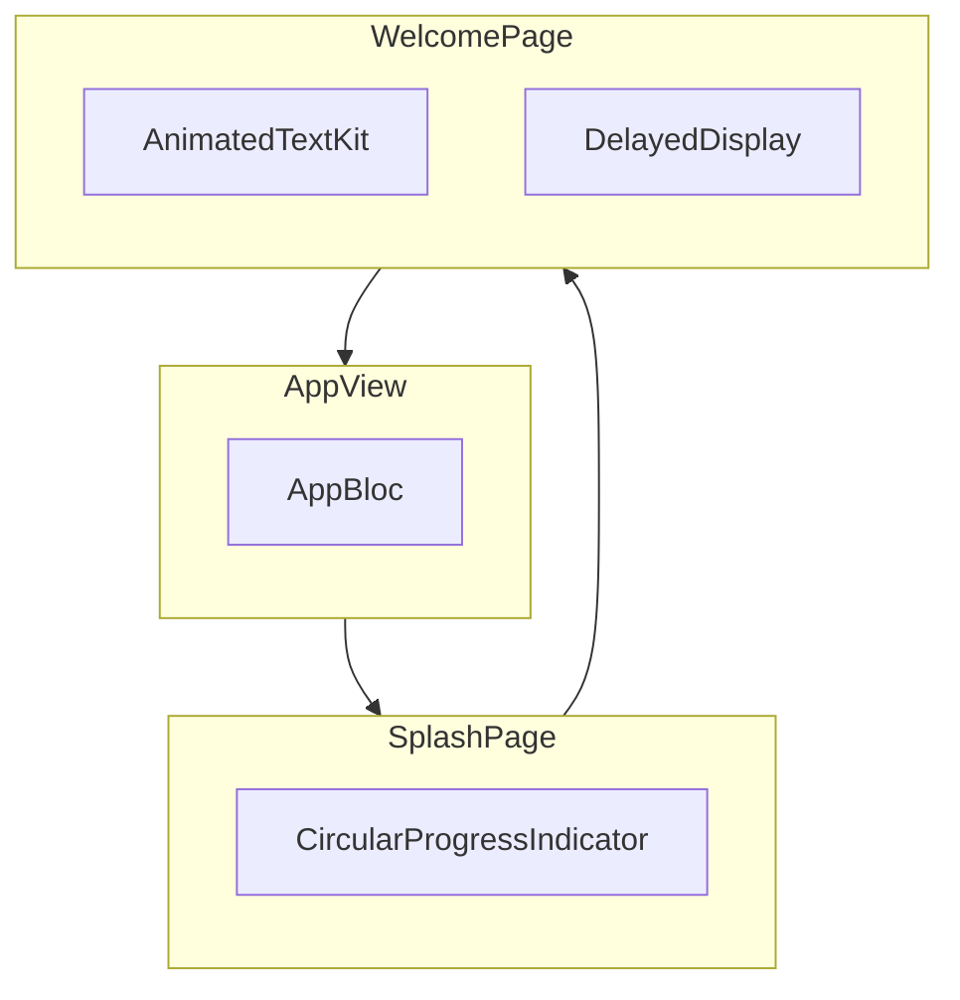
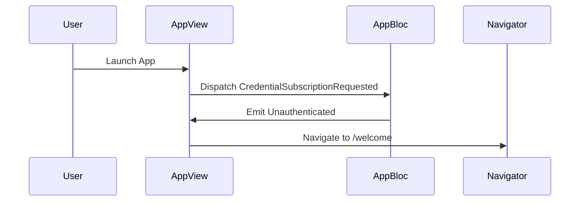
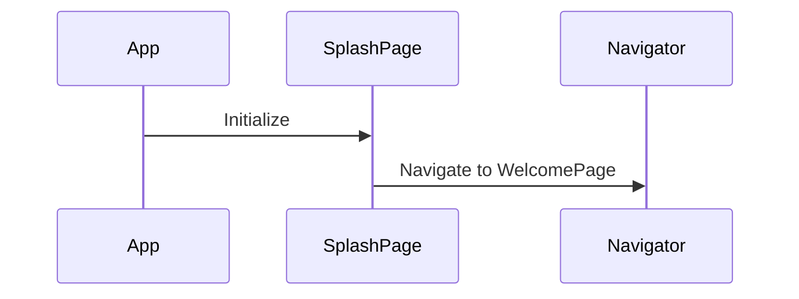
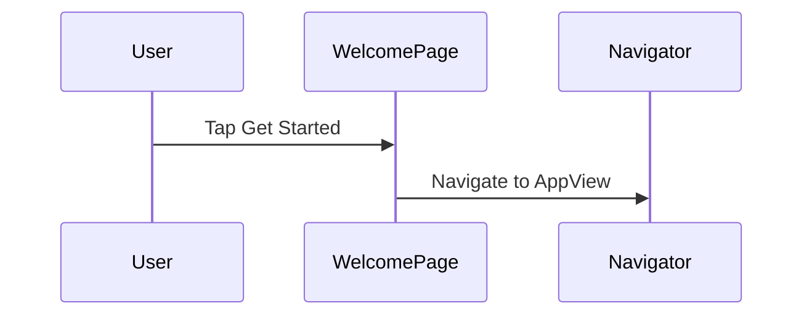

# App Overview

The app feature encompasses the core functionalities and user interface of the application. (No specific GIFs were identified for this feature.)

# App State Machine

This document provides an overview of the classes in the `app/bloc` directory, along with their relationships, represented as class diagrams using Mermaid syntax.

## Class Diagram

## Description

### AppBloc
The `AppBloc` class is the main Bloc for managing the application's state. It listens to events and updates the state accordingly. The key events handled by `AppBloc` include:
- `CredentialSubscriptionRequested`: Subscribes to the authentication repository's credential stream.
- `LogoutPressed`: Handles user logout.
- `VerifyOnboardingStatus`: Verifies the onboarding status of the current user.

### AppEvent
`AppEvent` is the base class for all events in the `AppBloc`. Specific events extend this class to handle different actions within the application.

### AppState
`AppState` is the base class for all states in the `AppBloc`. Specific states extend this class to represent different stages of the application's lifecycle. Examples include:
- `Starting`: Represents the initial state of the application.
- `Unauthenticated`: Represents the state when the user is not authenticated.
- `Authenticated`: Represents the state when the user is authenticated. This state is further extended by `OnboardingRequired` to indicate that the user requires onboarding.

### Relationships
- `AppBloc` depends on `AppEvent` and `AppState` to manage the application's state.
- `AppEvent` is extended by specific events like `CredentialSubscriptionRequested`, `LogoutPressed`, and `VerifyOnboardingStatus`.
- `AppState` is extended by specific states like `Starting`, `Unauthenticated`, and `Authenticated`. The `Authenticated` state is further extended by `OnboardingRequired`.

# App Views

This document provides an overview of the views (screens/pages) in the `lib/app/view` directory. Each view plays a unique role in the application, and this document explores their relationships, interactions, and behaviors in a conversational manner.

## Component Diagram

## View Details

### AppView
The `AppView` serves as the backbone of the application. It is responsible for managing navigation and providing the `AppBloc` to the widget tree. This view listens to the `AppBloc` and reacts to its states. For instance, when the user is unauthenticated, the `AppView` navigates to the welcome screen. If onboarding is required, it redirects to the signup page. And finally, if the user is onboarded, it takes them to the home screen. The lifecycle of `AppView` is tightly coupled with the initialization of the `AppBloc`, ensuring that authentication events are handled seamlessly.

#### Sequence Diagram

### SplashPage
The `SplashPage` is a simple yet essential part of the application. It provides a loading indicator while the app initializes. Although it does not interact with any blocs, its primary role is to offer visual feedback to the user during the initialization phase. Once the initialization is complete, the `SplashPage` navigates to the `WelcomePage`. This view is stateless, making it lightweight and efficient.

#### Sequence Diagram

### WelcomePage
The `WelcomePage` is the first point of interaction for unauthenticated users. It is designed to captivate users with branding and animations, creating a memorable first impression. This view does not listen to any blocs but uses animations like `AnimatedTextKit` and `DelayedDisplay` to enhance user engagement. When the user interacts with the `WelcomePage`, such as tapping the "Get Started" button, it navigates back to the `AppView`.

#### Sequence Diagram

