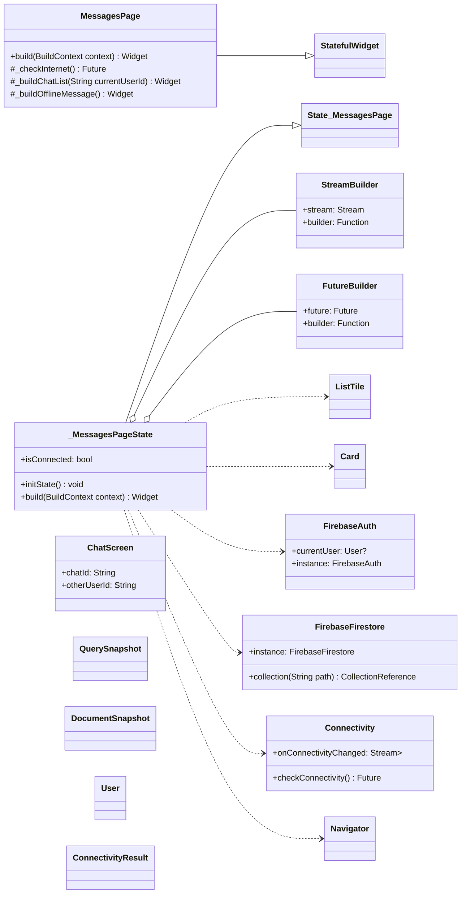
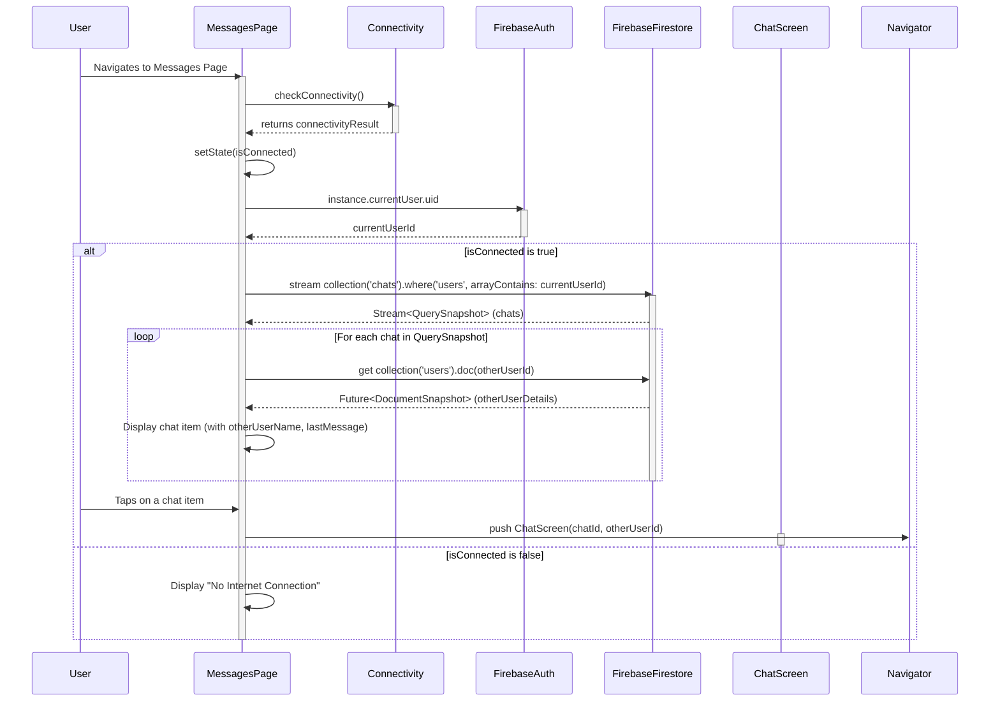
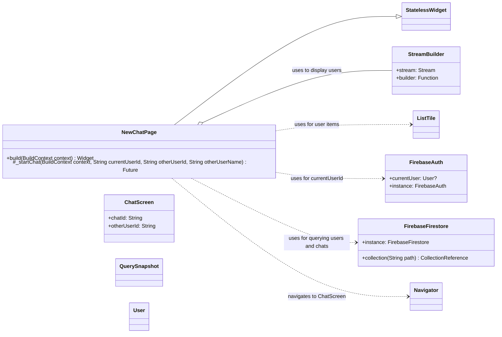
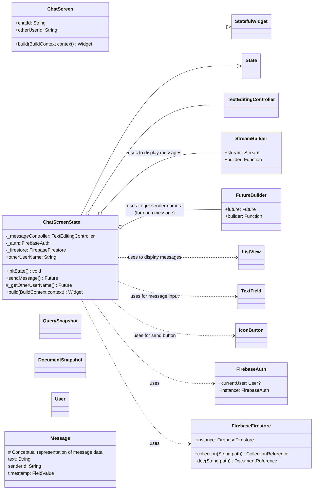
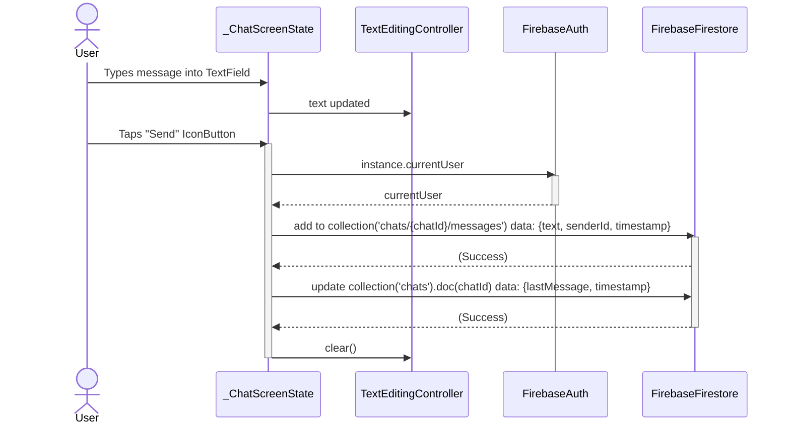

# Chat Overview

## 1. Overall Feature Overview

The **Chat** feature enables real-time text-based communication between users within the application, primarily facilitating interaction between tutors and students. It allows users to:

* View a list of their ongoing conversations.
* Initiate new chats with other users.
* Send and receive messages within a dedicated chat screen.

The feature is primarily composed of three main UI components: `MessagesPage` for listing existing chats, `NewChatPage` for starting new conversations, and `ChatScreen` for the actual messaging interface. Data persistence and real-time updates are handled by `Firebase Firestore`, accessed through the `ChatRepository` (from the core module) and direct Firestore SDK calls in the UI components.

---

## 2. Chat List Sub-Feature (`MessagesPage`)

### 2.1. Overview

The `MessagesPage` displays a list of all chat conversations the current user is a part of. Each item in the list typically shows the name of the other participant and the last message exchanged. Tapping on a conversation navigates the user to the `ChatScreen` for that specific chat. This page also includes basic internet connectivity checking.

### 2.2. Class Diagram (`MessagesPage`)



#### Key Relationships:

* `MessagesPage` is a `StatefulWidget` managing `_MessagesPageState`.
* `_MessagesPageState` uses `StreamBuilder` to listen to chat data from `FirebaseFirestore`.
* For each chat, it uses a `FutureBuilder` to fetch the other participant's name from `FirebaseFirestore`.
* It uses `FirebaseAuth` to get the current user's ID.
* It uses the `connectivity_plus` package to check and monitor network status.
* Tapping a chat item navigates to the `ChatScreen`.

### 2.3. Sequence Diagram: Loading and Displaying Chats



### 2.4. State Management

The `MessagesPage` primarily uses:
* Local `StatefulWidget` state (`isConnected`).
* `StreamBuilder` to reactively display the list of chats based on real-time data from `FirebaseFirestore`.
* `FutureBuilder` nested within the `StreamBuilder`'s item builder to asynchronously fetch and display the names of other participants in each chat.
* The `connectivity_plus` package stream to update the `isConnected` state.

No dedicated BLoC is used for this page; state is managed through Flutter's built-in mechanisms for handling asynchronous data and local UI state.

---

## 3. Start New Chat Sub-Feature (`NewChatPage`)

### 3.1. Overview

The `NewChatPage` allows the current user to browse a list of other registered users and initiate a new private chat conversation with any of them. If a chat already exists between the two users, it navigates to the existing `ChatScreen`; otherwise, it creates a new chat document in Firestore before navigating.

### 3.2. Class Diagram (`NewChatPage`)



#### Key Relationships:

* `NewChatPage` is a `StatelessWidget`.
* It uses a `StreamBuilder` to fetch and display a list of users from `FirebaseFirestore`, excluding the current user.
* `FirebaseAuth` is used to get the `currentUserId`.
* The `_startChat` method handles the logic of finding an existing chat or creating a new one in `FirebaseFirestore`.
* Tapping a user navigates to the `ChatScreen`.

### 3.3. Sequence Diagram: Starting a New Chat

```mermaid
sequenceDiagram
    actor User
    participant NewChatPage
    participant FirebaseAuth
    participant FirebaseFirestore
    participant ChatScreen

    User->>NewChatPage: Navigates to New Chat Page
    activate NewChatPage
    NewChatPage->>FirebaseAuth: instance.currentUser.uid
    activate FirebaseAuth
    FirebaseAuth-->>NewChatPage: currentUserId
    deactivate FirebaseAuth

    NewChatPage->>FirebaseFirestore: stream collection('users')
    activate FirebaseFirestore
    FirebaseFirestore-->>NewChatPage: Stream<QuerySnapshot> (allUsers)
    NewChatPage->>NewChatPage: Filters out currentUserId, displays list of other users
    deactivate FirebaseFirestore

    User->>NewChatPage: Taps on a user to chat with
    NewChatPage->>NewChatPage: _startChat(context, currentUserId, otherUserId, otherUserName)
    activate FirebaseFirestore # For chat checking/creation
    NewChatPage->>FirebaseFirestore: query collection('chats').where('users', arrayContains: currentUserId).where('users', arrayContains: otherUserId)
    FirebaseFirestore-->>NewChatPage: QuerySnapshot (existingChats)
    alt Existing chat found
        NewChatPage->>NewChatPage: chatId = existingChat.id
    else No existing chat
        NewChatPage->>FirebaseFirestore: add to collection('chats') data: {users: [currentUserId, otherUserId], ...}
        FirebaseFirestore-->>NewChatPage: newChatDocumentRef
        NewChatPage->>NewChatPage: chatId = newChatDocumentRef.id
    end
    deactivate FirebaseFirestore
    NewChatPage->>Navigator: push ChatScreen(chatId, otherUserId)
    activate ChatScreen
    deactivate ChatScreen
    deactivate NewChatPage
```

### 3.4. State Management

`NewChatPage` is a `StatelessWidget`.
* It uses `StreamBuilder` to display the list of users reactively from `FirebaseFirestore`.
* The logic for finding or creating a chat room is encapsulated within the `_startChat` method, which is called directly upon user interaction.

No dedicated BLoC or complex local state management is employed for this page.

---

## 4. Chat Screen Sub-Feature (`ChatScreen`)

### 4.1. Overview

The `ChatScreen` is the core messaging interface where users exchange text messages in real-time. It displays the history of messages in a conversation, ordered by time, and provides an input field for composing and sending new messages. User names for messages are fetched dynamically.

### 4.2. Class Diagram (`ChatScreen`)



#### Key Relationships:

* `ChatScreen` is a `StatefulWidget` managing `_ChatScreenState`.
* `_ChatScreenState` holds a `TextEditingController` for message input and references to `FirebaseAuth` and `FirebaseFirestore`.
* It uses a `StreamBuilder` to listen for real-time messages from the specified chat's `messages` subcollection in Firestore.
* Within the message list, it uses `FutureBuilder` to fetch the sender's name for each message (note: this could be optimized).
* The `sendMessage` method handles adding new messages to Firestore and updating the main chat document's `lastMessage` field.

### 4.3. Sequence Diagram: Sending a Message



### 4.4. Sequence Diagram: Receiving Messages

```mermaid
sequenceDiagram
    participant FirebaseFirestore
    participant ChatScreenState as _ChatScreenState
    participant ListView

    ChatScreenState->>FirebaseFirestore: stream collection('chats/{chatId}/messages').orderBy('timestamp')
    activate FirebaseFirestore
    FirebaseFirestore-->>ChatScreenState: Stream<QuerySnapshot> (messages)
    deactivate FirebaseFirestore # Stream remains open

    loop Firestore pushes new QuerySnapshot (new/updated message)
        FirebaseFirestore->>ChatScreenState: New QuerySnapshot
        activate ChatScreenState
        ChatScreenState->>ListView: Rebuilds with new messages
        activate ListView
        loop For each message in QuerySnapshot
            ChatScreenState->>FirebaseFirestore: get collection('users').doc(message.senderId)
            activate FirebaseFirestore
            FirebaseFirestore-->>ChatScreenState: Future<DocumentSnapshot> (senderDetails)
            deactivate FirebaseFirestore
            ChatScreenState->>ListView: Displays message with senderName
        end
        deactivate ListView
        deactivate ChatScreenState
    end
```

### 4.5. State Management

`ChatScreen` uses:
* Local `StatefulWidget` state to manage the `TextEditingController` for the message input field (`_messageController`), the other user's name (`otherUserName`), and potentially loading states for fetching `otherUserName`.
* `StreamBuilder` to reactively display the list of messages in real-time from `FirebaseFirestore`.
* `FutureBuilder` within the message list item builder to fetch and display the sender's name for each message.

Similar to other chat components, it does not use a dedicated BLoC, relying on Flutter's built-in state management widgets for handling asynchronous data and UI updates.

---

## 5. External Dependencies for Chat Feature

The **Chat** feature relies on the following key external packages:

* **`cloud_firestore`**:
    * **Purpose**: Provides access to Google Cloud Firestore database.
    * **Usage**: Used extensively across `MessagesPage`, `NewChatPage`, and `ChatScreen` for storing, retrieving, and listening to real-time updates for chat rooms and messages. Also used to fetch user details (names).
* **`firebase_auth`**:
    * **Purpose**: Handles user authentication with Firebase.
    * **Usage**: Used in all chat components to get the `currentUserId` for querying relevant chats/messages and identifying message senders.
* **`connectivity_plus`**:
    * **Purpose**: Allows checking the network connectivity status of the device.
    * **Usage**: Used in `MessagesPage` to display an offline message if the user has no internet connection, preventing attempts to load chats.

These packages are fundamental to the chat feature's ability to provide real-time, persistent messaging.

