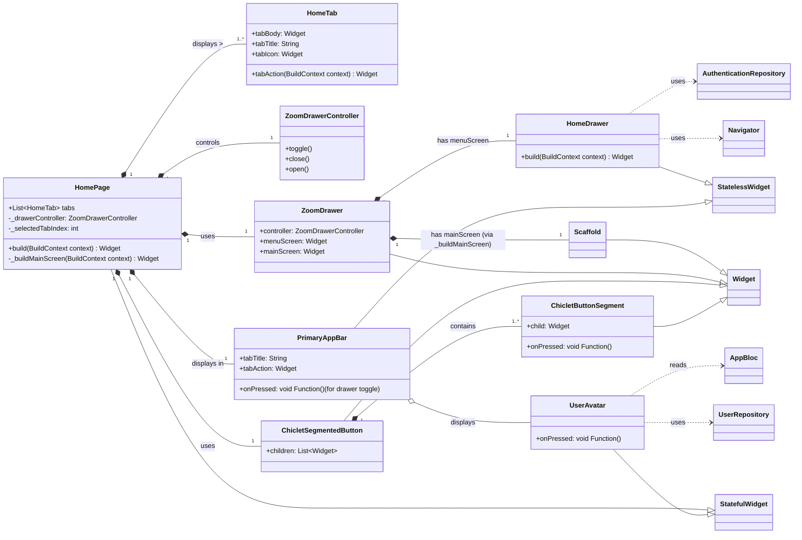

# Home Overview
The Home feature serves as the primary navigation hub of the application after the user is authenticated and onboarded. It presents a user interface with a main content area, a bottom navigation bar for switching between primary sections (tabs), and a slide-out drawer for accessing settings, support, and other application-level actions.

The HomePage widget is the core of this feature. It utilizes a ZoomDrawer for the side menu and a ChicletSegmentedButton for tab navigation. Each tab is defined by a HomeTab object, which encapsulates the tab's title, icon, body content, and any specific actions available in the app bar for that tab.

## Class Diagram
This diagram shows the main classes and widgets involved in the Home feature and their relationships.

## Key Relationships

- **`HomePage`** manages a list of `HomeTab` objects.
- **`HomePage`** uses a `ZoomDrawerController` to control the `ZoomDrawer`.
- The **`ZoomDrawer`** displays:
  - `HomeDrawer` as its **menu screen**.
  - The main content (`Scaffold` managed by `HomePage`) as its **main screen**.
- **`HomePage`** uses `ChicletSegmentedButton` (composed of `ChicletButtonSegments`) for tab navigation.
- **`HomePage`** displays a `PrimaryAppBar`, which can display a `UserAvatar`.

## Sequence Diagram

This diagram illustrates the **sequence of interactions** when a user taps on a tab in the bottom navigation bar.

### Flow Summary

1. The **User** taps on a `ChicletButtonSegment` representing a tab.
2. The `onPressed` callback of the `ChicletButtonSegment` is triggered.
3. Inside `HomePageState`, `setState` is called to update `_selectedTabIndex`.
4. The `HomePage` rebuilds.  
   The `AnimatedSwitcher` receives the new `tabBody` widget.
5. The `AnimatedSwitcher` transitions to display the **NewTabContent** (the `tabBody` of the newly selected `HomeTab`).
6. The `PrimaryAppBar` updates its `tabTitle` and `tabAction` based on the new selected tab.

---

## Home Feature State Management

Unlike the other features, the **Home** feature does **not** manage its state using a bloc or cubit.  
This is because the state of the `HomePage` is fairly simple and only requires keeping track of the tab index.  
Thus, `HomePage` is managed using a `StatefulWidget` that tracks:

### Managed State

- **`_selectedTabIndex` (int)**  
  An integer representing the index of the currently active tab.  
  This determines which `HomeTab`’s content and app bar details are displayed.

- **`_drawerController` (ZoomDrawerController)**  
  Manages the state (open/closed) of the `ZoomDrawer`.  
  Interactions with this controller (e.g., toggling the drawer) are handled by the `ZoomDrawer` widget itself,  
  but the controller instance is held by `HomePageState`.

### State Transitions for Tab Selection

- **Initial State**
  - `_selectedTabIndex` is initialized (e.g., to `0`).
  - The content and app bar for the first tab are displayed.

- **User Interaction**
  - The user taps on a `ChicletButtonSegment` inside the `ChicletSegmentedButton`.

- **`onPressed` Callback**
  - The `onPressed` callback of the tapped segment is invoked.

- **`setState()`**
  - Inside the callback, `setState()` is called, updating `_selectedTabIndex`  
    to the index of the tapped segment.

- **Rebuild**
  - The `HomePage` widget and its relevant children (like `AnimatedSwitcher` for the body  
    and `PrimaryAppBar`) rebuild.

### UI Update

- The `AnimatedSwitcher` displays the `tabBody` of the `HomeTab` at the new `_selectedTabIndex`.

- The `PrimaryAppBar` updates its `tabTitle` and `tabAction` based on the properties  
  of the `HomeTab` at the new `_selectedTabIndex`.

This internal state management is **suitable** for `HomePage` because its state is primarily concerned  
with local UI presentation (which tab is active, drawer visibility)  
and **doesn’t** need to be shared across unrelated features.

---

## External Dependencies

The **Home** feature leverages several external packages to achieve its functionality and appearance:

1. ### [chiclet](https://pub.dev/packages/chiclet)

- **Purpose**: Provides custom UI elements.
- **Usage**:
  - `ChicletSegmentedButton` and `ChicletButtonSegment` are used to create the stylized bottom tab navigation bar in `HomePage`.
  - `ChicletAnimatedButton` is used for the action button within the `PrimaryAppBar` (e.g., **"New Session"**, **"New Message"**).

2. ### [flutter_zoom_drawer](https://pub.dev/packages/flutter_zoom_drawer)

- **Purpose**: Implements the main drawer navigation.
- **Usage**:
  - The `ZoomDrawer` widget wraps the `HomePage`’s main screen and the `HomeDrawer`, providing the characteristic zoom/slide animation.
  - `ZoomDrawerController` is used to programmatically control the drawer’s state (e.g., toggling from the `PrimaryAppBar`).

3. ### [flutter_bloc](https://pub.dev/packages/flutter_bloc)

- **Purpose**: State management and dependency injection.
- **Usage**:
  - While `HomePage` itself uses `StatefulWidget` for local UI state, `HomeDrawer` accesses `AuthenticationRepository` (typically via `context.read(AuthenticationRepository)()`).
  - `UserAvatar` (used in `PrimaryAppBar`) also reads from `AppBloc` and `UserRepository`.

4. ### [delayed_display](https://pub.dev/packages/delayed_display)

- **Purpose**: Adds entrance animations to widgets.
- **Usage**:
  - Used in `PrimaryAppBar` to animate the appearance of the tab title and action widgets, enhancing visual appeal when switching tabs or when the app bar first appears.

5. ### [cached_network_image](https://pub.dev/packages/cached_network_image)

- **Purpose**: Efficiently loads and caches network images.
- **Usage**:
  - Employed by the `UserAvatar` widget (displayed in the `PrimaryAppBar`) to show the user’s profile picture, with placeholder and error handling.

6. ### [random_avatar](https://pub.dev/packages/random_avatar)

- **Purpose**: Generates placeholder avatars.
- **Usage**:
  - Used by the `UserAvatar` widget as a fallback when a user’s profile image is not available, providing a visually consistent placeholder based on the user’s name.

These packages contribute significantly to the **user experience** and **structural organization** of the Home feature.