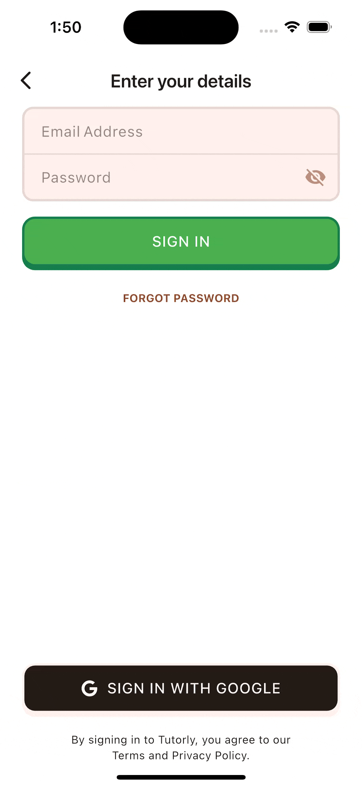
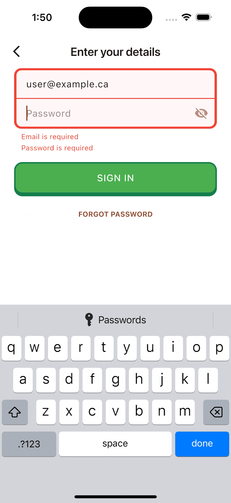
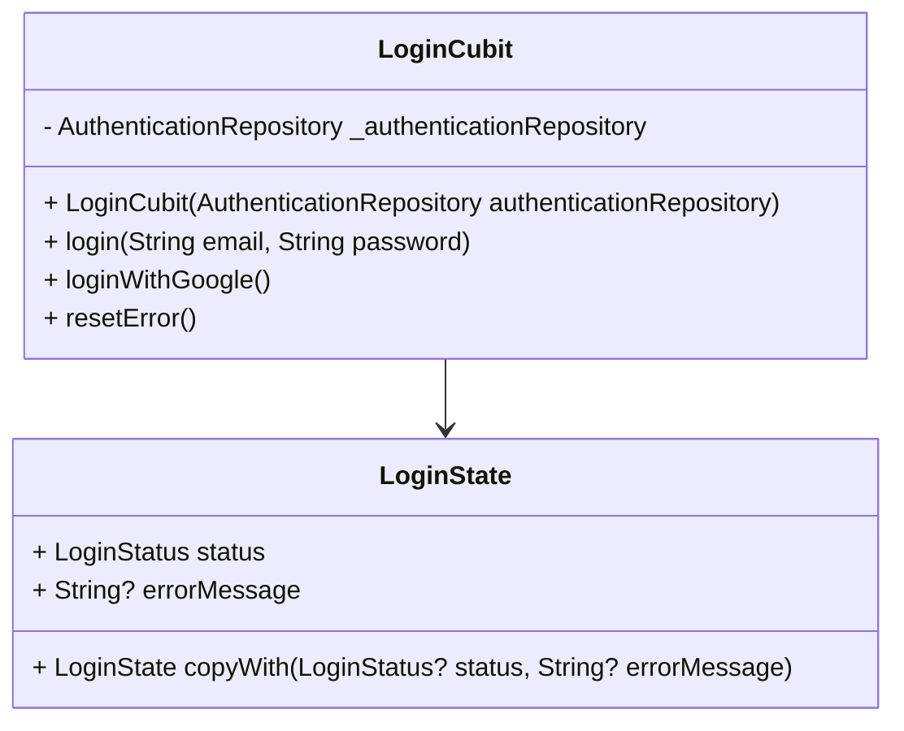
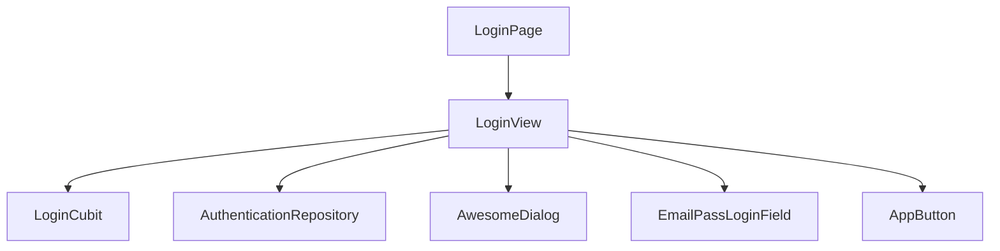
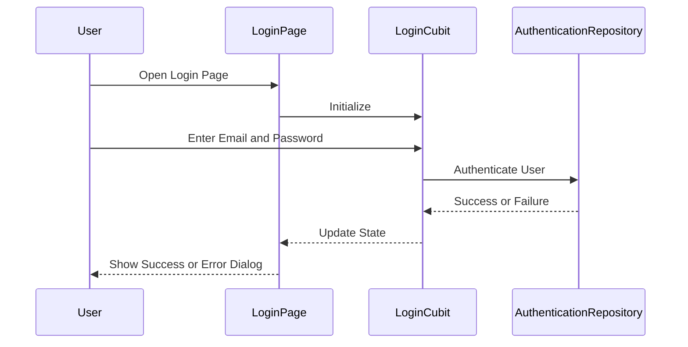
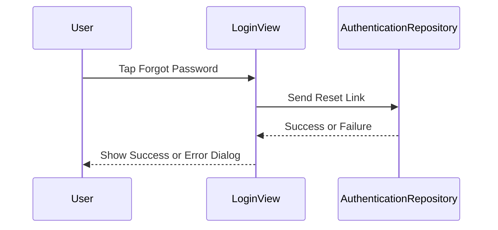

# Login Overview

We decided to make the login feature separated from the signup feature, as their functionality do not have any overlap. The login feature is designed to handle login requests via email and password, as well as Google sign-in.

Since this functionality is isolated from the rest of the app, it would be easy to implement new methods of login, with little worry about how it would integrate. A future method of login that would be interesting is password-less login, which would allow users to login via a link sent to their email. This would be a great addition to the app, as it would allow users to login without having to remember a password.

## Dependencies

The core functionality of the login feature is handled by its state machine, which only has one direct external dependency: 

- [`flutter_bloc`](https://pub.dev/packages/flutter_bloc): This package provides a way to manage the state of the application using the BLoC (Business Logic Component) pattern. It allows us to separate the business logic from the UI, making it easier to test and maintain.
- [`core.authentication_repository`](https://github.com/ohjime/tutorlm/blob/main/lib/core/repositories/authentication_repository.dart): This is our local package that provides a simple interface for our application to handle our authentication and sign up needs as we require.

The UI of the login feature is built using Flutter, and the following external dependencies:

- [`delayed_display`](https://pub.dev/packages/delayed_display): For animating the appearance of UI elements with customizable delays and transitions.
- [`flutter_form_builder`](https://pub.dev/packages/flutter_form_builder): Provides a rich set of form widgets and utilities for building and managing complex forms.
- [`form_builder_validators`](https://pub.dev/packages/form_builder_validators): Offers a collection of validation functions to ensure form input integrity.
- [`awesome_dialog`](https://pub.dev/packages/awesome_dialog): Used to display customizable modal dialogs for info, success, warning, and error states.
- [`font_awesome_flutter`](https://pub.dev/packages/font_awesome_flutter): Supplies a wide range of Font Awesome icons for use throughout the UI.

## Feature Overview
Below is a detailed breakdown of each implemented functionality within the login feature. Each point is cross-referenced with the user stories that guided its development, ensuring a user-centric approach to the design and implementation:

### Login with Email and Password

***User Story #60***: *"As a user I would like to be able to log in with my email and password so that I can securely access my account"*

Users will want the login feature to allow them to log in using their email and password. This is a common authentication method that users are familiar with, and it provides a straightforward way for them to access their accounts.

Flutter has a built-in widget called `TextFormField` that allows users to enter text input. However, their default behavior when and error occurs, is to expand the container and display the error message below the field. The animation for this expansion is not smooth, and is amplified when there are multiple fields in a column. 

<figure style={{textAlign: 'center'}}>
    
    <figcaption>**Figure 1**: Default TextFormField Error Animation</figcaption>
</figure>

It was also hard to emulate the Duolingo login form field, which is a design goal we wanted to achieve. Having the error message appear below each field will cause the email field error to overlap with the bottom field content.

<figure style={{textAlign: 'center'}}>
    
    <figcaption>**Figure 2**: Duolingo Login Form Field</figcaption>
</figure>

Our solution was to override this behavior was to combine the fields into a single container, and have their errors displayed together line by line:

<figure style={{textAlign: 'center'}}>
    |||
    |:-:|:-:|
    | *Smooth resizing on new error* | *Smooth resizing on error change* |
</figure>
<figcaption style={{textAlign: 'center'}}>**Figure 3**: Double Error Layout and Smooth Resizing</figcaption>
  The container resize animation was tweaked to be smoother. We also made the google sign-in button fade out when the keyboard is up, which also helped with any over-scroll jitter.

Lastly, server errors, such as "*email exists*" or "*email banned*" are displayed using the [AwesomeDialog package](https://pub.dev/packages/awesome_dialog), which is a modal dialog that appears on top of the current screen with premade admonitions. In the future, a more cohesive design would be to have server errors display under the login form field.

<figure style={{textAlign: 'center'}}>
    
    <figcaption>**Figure 4**: Login Submit Error</figcaption>
</figure>

### Login with Google

***User Story #61***: *"As a user I would like to be able to log in with my Google account, so that I can securely access my account*"

This was an easy functionality to implement when using Firebase Authentication. Firebase Console provides all the necessary configuration files containing Public API Keys for iOS, Android and Web. They also provide a client to handle the OS Specific UI for authenticating and retrieving the credential with their [google_sign_in package](https://pub.dev/packages/google_sign_in).

<figure style={{textAlign: 'center'}}>
    
    <figcaption>**Figure 4**: Google Sign In</figcaption>
</figure>

### Forgot Password

***User Story #81***: *"As a user, I would like the ability to reset my password so that I can still access my account if I forgot my password"*

The login screen provides a *Forgot Password* button directly beneath the main sign-in form. When a user taps this button, they are typically prompted to enter their email address, after which a password reset link is sent to their inbox. This is a standard approach in modern authentication flows, ensuring users can regain access to their accounts without manual intervention from support.

<figure style={{textAlign: 'center'}}>
    
    <figcaption>**Figure 4**: Google Sign In</figcaption>
</figure>

We designed *Forgot Password* button to mock the duolingo login screen, which is a design goal we wanted to achieve. The actual modal pop-up however does not. Being stressed for time, we just used the default UI of the awesome_dialog package, which responds well to the keyboard being up, and when the form is submitted. The functionality also does not follow the architecture of the rest of the app, as it is not handled by the login state machine and simply handled inside of the `onSubmit` function of the form (Again due to time constraints)

# Login Cubit Documentation

This document provides an overview of the `LoginCubit` and its associated state management for the login feature.

## Class Diagram

## Description

### LoginCubit
The `LoginCubit` is responsible for managing the state of the login process. It interacts with the `AuthenticationRepository` to handle user authentication. The cubit provides methods for logging in with email and password, logging in with Google, and resetting errors.

#### Methods
- `login(String email, String password)`: Initiates the login process using the provided email and password. Emits a loading state, followed by either a success or failure state.
- `loginWithGoogle()`: Initiates the login process using Google authentication. Emits a loading state, followed by either a success or failure state.
- `resetError()`: Resets the error state to its initial value.

### LoginState
The `LoginState` class represents the state of the login process. It includes the following properties:
- `status`: An enum representing the current status of the login process (`initial`, `loading`, `success`, or `failure`).
- `errorMessage`: An optional string containing an error message if the login process fails.

The `copyWith` method allows for creating a new instance of `LoginState` with updated properties while preserving the existing ones.

# Login View Documentation

This document provides an overview of the `LoginPage` and its associated components for the login feature.

## Component Diagram

## View Details

### LoginPage
The `LoginPage` serves as the entry point for the login feature. It initializes the `LoginCubit` and provides it to the widget tree. This page is responsible for managing the state of the login process and handling user interactions.

### LoginView
The `LoginView` is a stateful widget that contains the UI for the login feature. It includes the following components:
- **EmailPassLoginField**: Used for creating and validating the Email Login Form
- **AppButton**: Custom buttons for user actions, such as signing in and resetting the password.
- **AwesomeDialog**: An external flutter package used for displaying dialogs, such as error messages and password reset confirmations. (Source Package: [awesome_dialog](https://pub.dev/packages/awesome_dialog))

#### Sequence Diagram

### Forgot Password Flow
The `LoginView` also includes a forgot password feature. When the user taps the "Forgot Password" button, a dialog is displayed where the user can enter their email address. Upon submission, the app sends a password reset link to the provided email address.

#### Sequence Diagram

