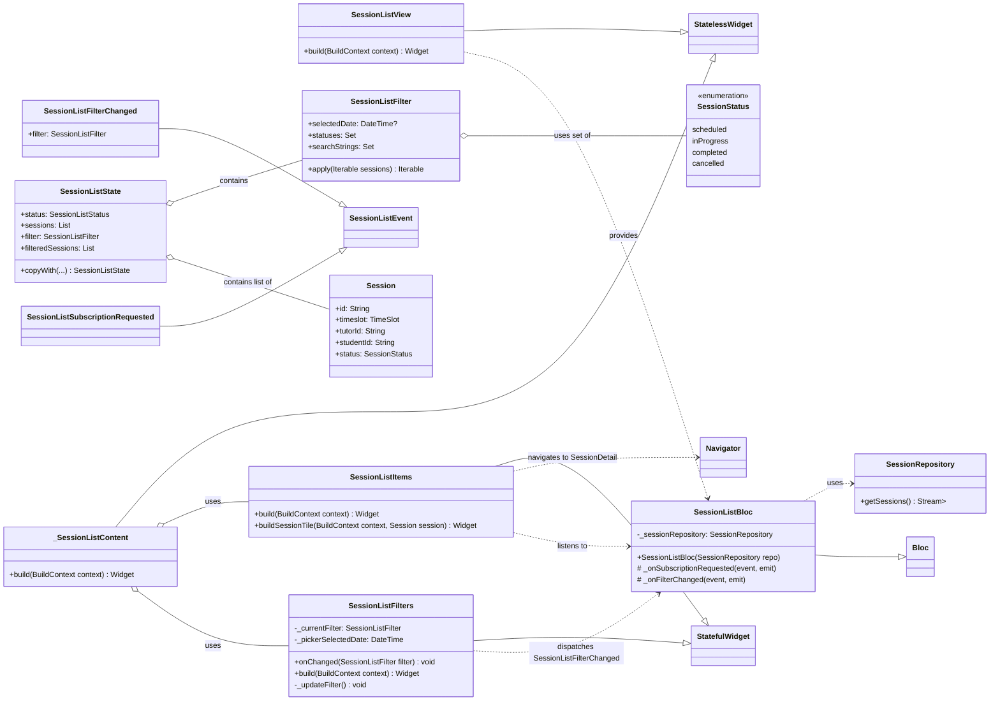
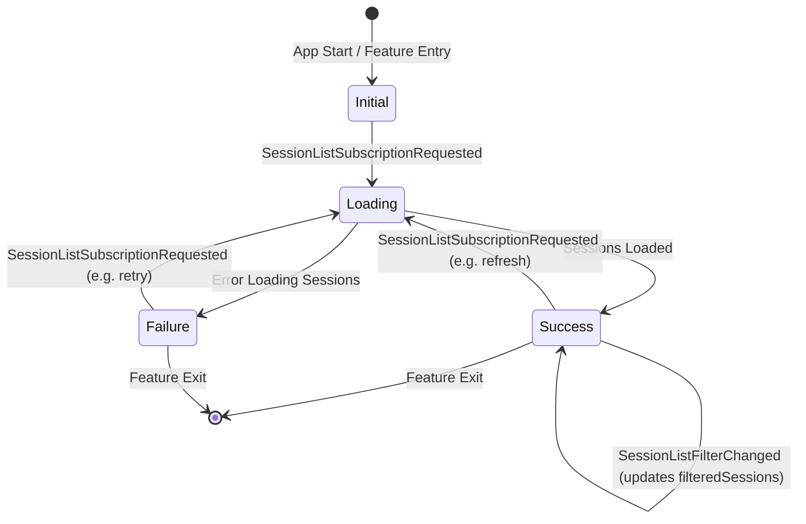
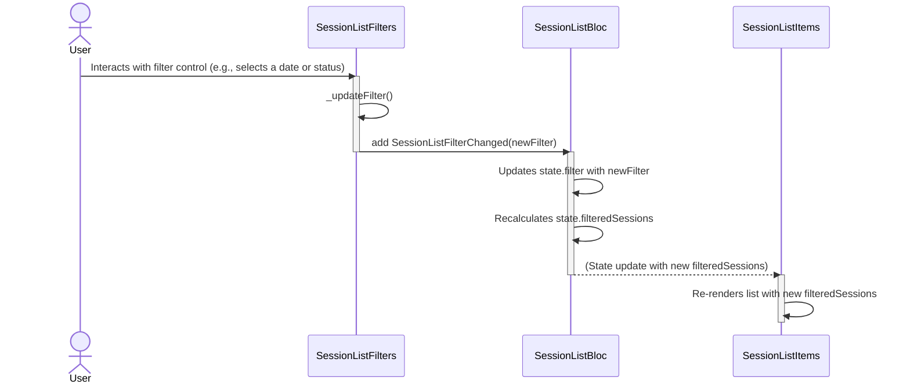
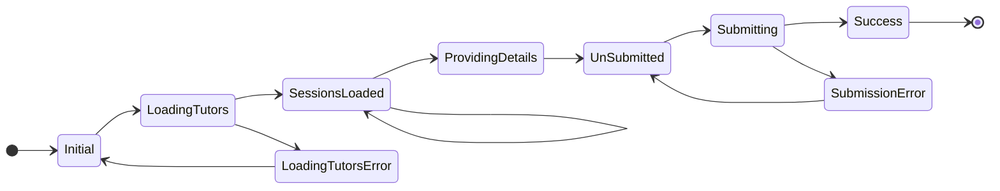
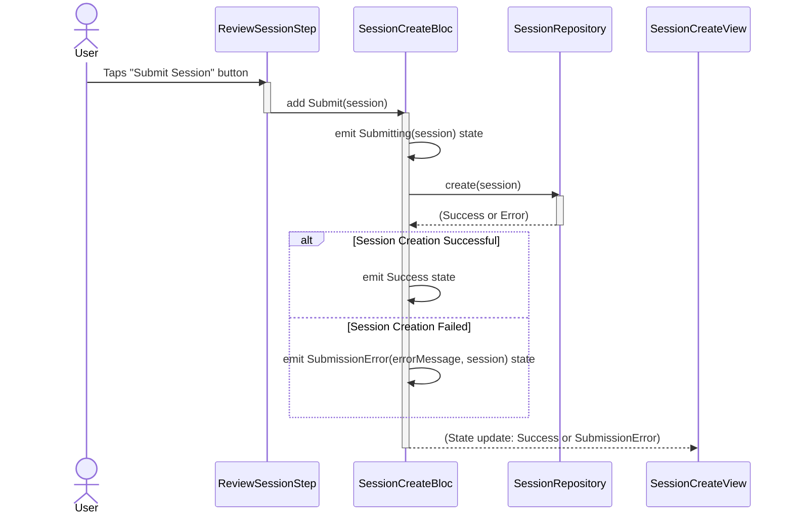
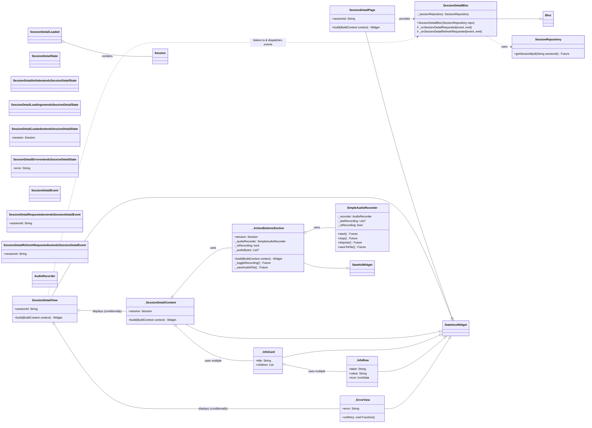
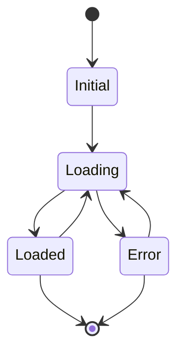
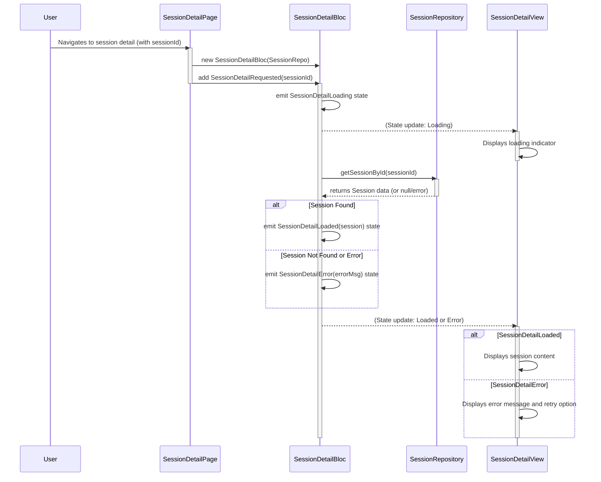

# Session Overview

## 1. Overall Feature Overview

The **Session** feature is a cornerstone of the application, enabling users (both students and tutors) to manage their learning and teaching engagements. It encompasses functionalities for:

* **Listing Sessions (`SessionList`):** Users can view a list of their past, current, and upcoming sessions. This view includes filtering capabilities by date and session status, and allows users to search for specific sessions.
* **Creating Sessions (`SessionCreate`):** Students can initiate the process of booking a new session. This involves selecting a tutor, choosing an available time slot from the tutor's schedule, adding any necessary details, reviewing the session information, and finally submitting the booking.
* **Viewing Session Details (`SessionDetail`):** Users can view detailed information about a specific session, including participant IDs, scheduled times, status, and potentially engage in actions related to the session like starting, ending, or recording audio.

These sub-features are interconnected, with users typically navigating from the list to details, or creating a session which then appears in their list. Each part utilizes BLoCs for state management and interacts with core repositories for data persistence.

---

## 2. Session List Sub-Feature

### 2.1. Overview

The **Session List** sub-feature provides users with a comprehensive view of their scheduled, ongoing, completed, or cancelled sessions. It's designed to be interactive, allowing users to filter sessions by date and status, and to search for specific sessions. Each item in the list serves as an entry point to the `SessionDetail` page.

### 2.2. Class Diagram (`SessionList`)

#### Key Relationships:

* `SessionListView` provides the `SessionListBloc`.
* `_SessionListContent` composes `SessionListFilters` and `SessionListItems`.
* `SessionListFilters` allows users to change the `SessionListFilter` and dispatches `SessionListFilterChanged` events to the `SessionListBloc`.
* `SessionListItems` listens to the `SessionListBloc` for the `filteredSessions` and displays them. Tapping an item navigates to the `SessionDetail` page.
* `SessionListBloc` subscribes to `SessionRepository` to get session data and applies the `SessionListFilter` from `SessionListState`.

### 2.3. State Diagram (`SessionListBloc`)

### 2.4. Sequence Diagram: Applying a Filter (`SessionList`)

---

## 3. Session Create Sub-Feature

### 3.1. Overview

The **Session Create** sub-feature guides a student through a multi-step process to book a new tutoring session. This typically involves selecting a tutor, choosing an available time slot from that tutor's schedule, optionally adding more details, reviewing the complete session information, and finally submitting the request. The feature uses a modal interface (`SessionCreateModal`) and a dedicated BLoC (`SessionCreateBloc`) to manage the state of this creation flow.

### 3.2. Class Diagram (`SessionCreate`)

```mermaid
classDiagram
    direction LR

    class SessionCreateModal {
        +build(BuildContext context) Widget
    }
    SessionCreateModal ..> SessionCreateBloc : provides

    class SessionCreateView {
        +build(BuildContext context) Widget
    }
    SessionCreateView o-- SessionCreateProgressBar : uses
    SessionCreateView o-- InitialStep : displays (conditionally)
    SessionCreateView o-- SelectSessionStep : displays (conditionally)
    SessionCreateView o-- AddDetailsStep : displays (conditionally)
    SessionCreateView o-- ReviewSessionStep : displays (conditionally)
    SessionCreateView o-- SessionCreated : displays (conditionally)
    SessionCreateView ..> SessionCreateBloc : listens to & dispatches events

    class SessionCreateProgressBar {
        +currentStep: int
        +totalSteps: int
    }

    class InitialStep {
        +build(BuildContext context) Widget
    }
    InitialStep ..> SessionCreateBloc : dispatches Start

    class SelectSessionStep {
        +build(BuildContext context) Widget
    }
    SelectSessionStep o-- TutorCards : uses
    SelectSessionStep o-- AvailableTimeSlots : uses
    SelectSessionStep ..> SessionCreateBloc : listens to & dispatches ChangeTutor, SelectSession

    class TutorCards {
        +tutorList: List<Map<String, dynamic>>
    }
    class AvailableTimeSlots {
        +selectedTutorUser: User
    }

    class AddDetailsStep {
        +build(BuildContext context) Widget
    }
    AddDetailsStep ..> SessionCreateBloc : dispatches ProvideDetails

    class ReviewSessionStep {
        +build(BuildContext context) Widget
    }
    ReviewSessionStep ..> SessionCreateBloc : dispatches Submit

    class SessionCreated {
        +build(BuildContext context) Widget
    }

    class SessionCreateBloc {
        -_tutorRepository: TutorRepository
        -_userRepository: UserRepository
        -_sessionRepository: SessionRepository
        +SessionCreateBloc(...)
        # _onStart(event, emit)
        # _onChangeTutor(event, emit)
        # _onSelectSession(event, emit)
        # _onProvideDetails(event, emit)
        # _onSubmit(event, emit)
        # _onBack(event, emit)
    }
    SessionCreateBloc --|> Bloc

    class SessionCreateState {
        +currentStep: int
    }
    class InitialState {
    }
    InitialState --|> SessionCreateState
    class SelectSessionState {
        +tutorData: Map<String, Map<String, dynamic>>
    }
    SelectSessionState --|> SessionCreateState
    class SessionDetailsState {
        +session: Session
    }
    SessionDetailsState --|> SessionCreateState
    class SessionReviewState {
        +session: Session
    }
    SessionReviewState --|> SessionCreateState
    class SubmissionSuccess {
    }
    SubmissionSuccess --|> SessionCreateState

    class Initial extends InitialState
    class LoadingTutors extends SelectSessionState
    class LoadingTutorsError extends SelectSessionState
    class SessionsLoaded extends SelectSessionState {
        +selectedTutor: Tutor
        +selectedUser: User
    }
    class ProvidingDetails extends SessionDetailsState
    class UnSubmitted extends SessionReviewState
    class Submitting extends SessionReviewState
    class SubmissionError extends SessionReviewState
    class Success extends SubmissionSuccess

    class SessionCreateEvent
    class Start extends SessionCreateEvent
    class ChangeTutor extends SessionCreateEvent
    class SelectSession extends SessionCreateEvent
    class ProvideDetails extends SessionCreateEvent
    class Submit extends SessionCreateEvent
    class Back extends SessionCreateEvent

    class SessionRepository {
        +create(Session session) Future<void>
    }
    class TutorRepository {
        +getTutors() Future<List<Tutor>>
    }
    class UserRepository {
        +getUser(String uid) Future<User>
    }
    class Session { }
    class Tutor { }
    class User { }
    class TimeSlot { }

    SessionCreateModal --|> StatelessWidget
    SessionCreateView --|> StatefulWidget
    SessionCreateProgressBar --|> StatelessWidget
    InitialStep --|> StatelessWidget
    SelectSessionStep --|> StatelessWidget
    TutorCards --|> StatelessWidget
    AvailableTimeSlots --|> StatelessWidget
    AddDetailsStep --|> StatelessWidget
    ReviewSessionStep --|> StatelessWidget
    SessionCreated --|> StatelessWidget

    SessionCreateBloc ..> TutorRepository : uses
    SessionCreateBloc ..> UserRepository : uses
    SessionCreateBloc ..> SessionRepository : uses
    SelectSessionState o-- Tutor : (via tutorData, selectedTutor)
    SelectSessionState o-- User : (via tutorData, selectedUser)
    SessionDetailsState o-- Session : contains
    SessionReviewState o-- Session : contains
```

#### Key Relationships:

* `SessionCreateModal` provides the `SessionCreateBloc`.
* `SessionCreateView` orchestrates the display of different step widgets (`InitialStep`, `SelectSessionStep`, etc.) based on the `SessionCreateState.currentStep`.
* Each step widget can dispatch events to the `SessionCreateBloc` (e.g., `Start`, `SelectSession`, `Submit`).
* `SessionCreateBloc` interacts with `TutorRepository`, `UserRepository`, and `SessionRepository` to fetch tutor data, user data (for tutor schedules), and to create the new session.

### 3.3. State Diagram (`SessionCreateBloc`)

### 3.4. Sequence Diagram: Submitting a New Session (`SessionCreate`)

---

## 4. Session Detail Sub-Feature

### 4.1. Overview

The **Session Detail** sub-feature allows users to view comprehensive information about a specific session they have selected from the `SessionList`. This includes details like the session ID, status, participants (tutor and student IDs), scheduled start and end times, and duration. It also provides a placeholder for session-related actions, such as starting, ending, or recording audio for the session.

### 4.2. Class Diagram (`SessionDetail`)

#### Key Relationships:

* `SessionDetailPage` provides the `SessionDetailBloc`.
* `SessionDetailView` listens to the `SessionDetailBloc` and conditionally displays either `_SessionDetailContent` (on success) or `_ErrorView`.
* `_SessionDetailContent` displays session information using `_InfoCard` and `_InfoRow` widgets, and includes `_ActionButtonsSection`.
* `_ActionButtonsSection` uses `SimpleAudioRecorder` for audio recording functionality.
* `SessionDetailBloc` interacts with `SessionRepository` to fetch details for a specific session.

### 4.3. State Diagram (`SessionDetailBloc`)

### 4.4. Sequence Diagram: Loading Session Details (`SessionDetail`)

---

## 5. External Dependencies for Session Feature

The **Session** feature (across its List, Create, and Detail parts) utilizes several external packages:

* **`flutter_bloc`**:
    * **Purpose**: Core state management.
    * **Usage**: `SessionListBloc`, `SessionCreateBloc`, and `SessionDetailBloc` are all built using this package to manage their respective states and business logic. `BlocProvider` and `BlocBuilder` (or `BlocListener`) are used in the UI.
* **`equatable`**:
    * **Purpose**: Simplifies value equality comparisons for BLoC states and events.
    * **Usage**: All BLoC states and events within the Session feature extend `Equatable`.
* **`delayed_display`**:
    * **Purpose**: Adds entrance animations.
    * **Usage**: Used in `SessionCreateView` to animate the appearance of step content.
* **`loading_indicator`**:
    * **Purpose**: Provides a collection of loading indicator animations.
    * **Usage**: Used in `SessionCreateView` for loading states (e.g., `LoadingTutors`).
* **`flutter_staggered_animations`**:
    * **Purpose**: Provides staggered animations for list items.
    * **Usage**: Used in `SessionListItems` to animate the appearance of session tiles as they are loaded or filtered.
* **`easy_date_timeline`**:
    * **Purpose**: Provides a customizable horizontal date picker.
    * **Usage**: Used in `SessionListFilters` for selecting a date to filter sessions.
* **`intl`**:
    * **Purpose**: Provides internationalization and localization utilities, including date/time formatting.
    * **Usage**: Used for formatting dates and times in `SessionListFilters`, `AvailableTimeSlots` (in `SessionCreate`), and `_SessionDetailContent`.
* **`change_case`**:
    * **Purpose**: Utility for converting string cases (e.g., `snake_case` to `Title Case`).
    * **Usage**: Used in `SessionListFilters` to format `SessionStatus` enum names for display in choice chips.
* **`flip_card_swiper`**:
    * **Purpose**: Creates a swipable card interface with a flip animation.
    * **Usage**: Used in `SelectSessionStep` (within `SessionCreate`) for displaying `TutorCards`.
* **`grouped_list`**:
    * **Purpose**: Displays a list view with items grouped by a specified criterion.
    * **Usage**: Used in `AvailableTimeSlots` (within `SessionCreate`) to group available time slots by day.
* **`record`**:
    * **Purpose**: Enables audio recording.
    * **Usage**: Used by `SimpleAudioRecorder` in the `SessionDetail` feature to record audio.
* **`file_picker`**:
    * **Purpose**: Allows users to pick files or save files to the device.
    * **Usage**: Used by `SimpleAudioRecorder` in the `SessionDetail` feature to allow users to save their recorded audio.
* **`percent_indicator`** (implicitly via `SessionCreateProgressBar`):
    * **Purpose**: Provides circular and linear progress indicators.
    * **Usage**: `SessionCreateProgressBar` uses `LinearPercentIndicator` from this package.

These packages enhance the functionality, user experience, and development efficiency of the Session feature.

<!-- External from 'record' package: AudioRecorder -->
<!-- Bloc is a base class (not shown in diagram) -->
