# Signup Overview

The signup feature guides new users through a dynamic onboarding flow that adapts to their chosen profile and collects all necessary information in a single process. Users can upload files, set their availability, and configure their preferences without downloading multiple apps or hunting for additional settings. This streamlined experience reduces confusion and simplifies account setup.

## Dependencies

The core signup logic is managed by its state machine, which has one direct external dependency:

- [`flutter_bloc`](https://pub.dev/packages/flutter_bloc): Provides the BLoC pattern for state management, decoupling business logic from UI and facilitating testing.

The signup UI is built in Flutter and relies on the following packages:

- [`flutter_form_builder`](https://pub.dev/packages/flutter_form_builder): Comprehensive form widgets and utilities.
- [`form_builder_validators`](https://pub.dev/packages/form_builder_validators): Validation functions for form inputs.
- [`image_picker`](https://pub.dev/packages/image_picker): Enables file and image uploads during onboarding.
- [`awesome_dialog`](https://pub.dev/packages/awesome_dialog): Displays modal dialogs for file upload feedback and error handling.

Further details on the Signup State Machine and its Views are available in the sub-sections below:

## Feature Overview

Below is a breakdown of each implemented functionality, cross-referenced with the user stories:

### Dynamic Onboarding Flow

***User Story #54***: *"As a user I want to have a dynamic onboarding flow for multiple user types so that I do not have to download different apps for different profiles."*

The signup wizard adjusts the sequence of steps based on the selected user type (e.g., tutor, student), presenting only relevant fields and options:

<figure style={{textAlign: 'center'}}>
    ||
    |:-:|
    | **Figure 1**: Dynamic signup wizard adapting to user type |
</figure>

### File Upload During Onboarding

***User Story #55***: *"As a user I want to be able to upload files directly in the onboarding step, so that I do not have to search where to add them later."*

Users can upload profile pictures, qualification documents, and other assets inline:

<figure style={{textAlign: 'center'}}>
    |||
    |:-:|:-:|
    | **Figure 2a**: Editing form entries with file inputs | **Figure 2b**: Placeholder image before upload |
</figure>

### Guided Onboarding Experience

***User Story #56***: *"As a user I want a guided onboarding experience so that I am not confused."*

Contextual hints and progress indicators help users complete each step without uncertainty:

<figure style={{textAlign: 'center'}}>
    ||
    |:-:|
    | **Figure 3**: Step progress indicator guiding users |
</figure>

### Single Signup Process

***User Story #57***: *"As a user I would like to have a single onboarding process, so that I can signup and configure all my information in one place without having to find out where else to put that information."*

All configuration—personal details, subjects, and schedules—happens in one flow:

<figure style={{textAlign: 'center'}}>
    |||
    |:-:|:-:|
    | **Figure 4a**: Email and password form fields | **Figure 4b**: Saved form entries review |
</figure>

### Easy-to-Use Schedule Form

***User Story #18***: *"As a user I would like to have an easy to use schedule form so that I don't spend too much time inputting my availability."*

A calendar-style selector allows quick availability selection:

<figure style={{textAlign: 'center'}}>
    ||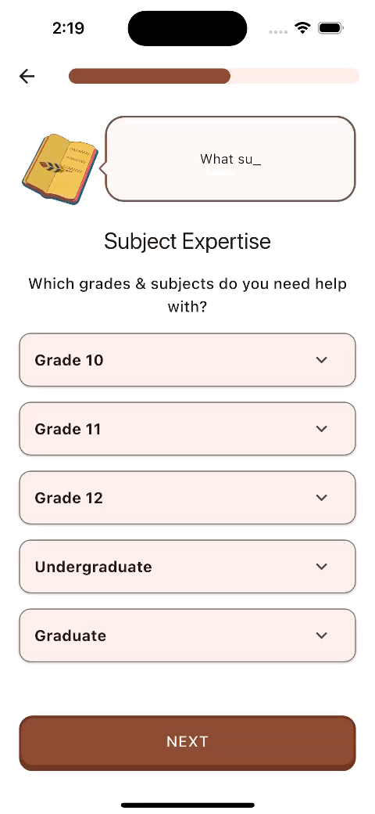|
    |:-:|:-:|
    | **Figure 5a**: Schedule selector interface | **Figure 5b**: Subject selection dropdown |
</figure>

Additional signup screens include typeahead search for topics and review screens:

<figure style={{textAlign: 'center'}}>
    |||
    |:-:|:-:|
    | **Figure 6a**: Typeahead subject search | **Figure 6b**: Final review before submission |
</figure>

# Signup State Machine

The signup process is orchestrated by `SignupCubit`, which handles form data collection incrementally and delegates persistence to domain repositories (`AuthenticationRepository`, `UserRepository`, `TutorRepository`, `StudentRepository`, `StorageRepository`). Each domain model (`User`, `Tutor`, `Student`) is stored and updated immutably in the state, leveraging `copyWith` for safe state transitions.


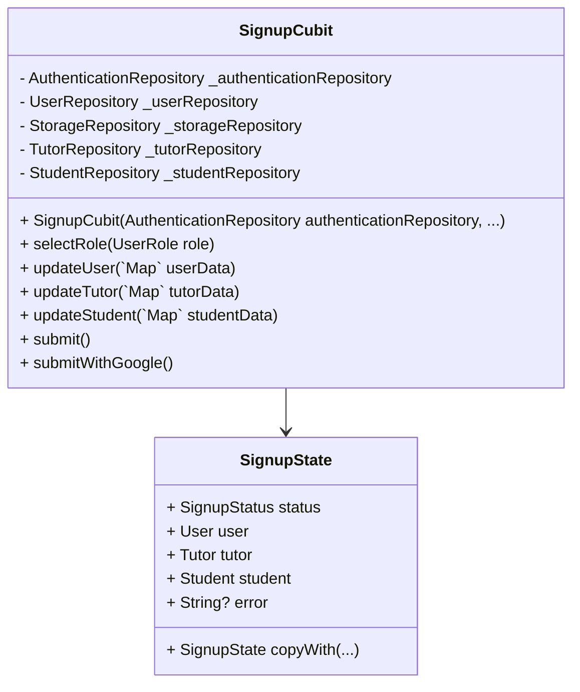

### SignupState

`SignupState` represents the current signup workflow state:
- **status**: `initial` | `loading` | `success` | `failure`
- **user**: Partial or complete `User` model
- **tutor**: Partial or complete `Tutor` model
- **student**: Partial or complete `Student` model
- **error**: Optional error message on failure

States are immutable; use `copyWith` to create new instances with updated fields.

### SignupCubit

`SignupCubit` manages interaction between UI and repositories, emitting new `SignupState` instances as the user progresses through signup.

#### Methods

- **selectRole(UserRole role)**
  Sets the selected user role (`tutor` or `student`) in state, allowing the UI to render appropriate form fields.

- **updateUser(`Map<String, dynamic>` userData)**
  Merges incoming `userData` into the existing `User` model via `copyWith`, updating form state without side effects.

- **updateTutor(`Map<String, dynamic>` tutorData)**
  Merges `tutorData` into the `Tutor` model via `copyWith`, updating tutor-specific fields.

- **updateStudent(`Map<String, dynamic>` studentData)**
  Merges `studentData` into the `Student` model via `copyWith`, updating student-specific fields.

- **submit()**
  Executes the full signup flow:
  1. Emit `loading` status.
  2. Call `authenticationRepository.signUp(...)` to create auth credentials.
  3. Upload profile images via `storageRepository.upload...`.
  4. Create role-specific record (`Tutor` or `Student`) in its repository.
  5. Persist the final `User` model with `userRepository.create`.
  6. Emit `success` on completion or `failure` with `error` on exception.

- **submitWithGoogle()**
  Similar to `submit()`, but begins with `authenticationRepository.signInWithGoogle()`. Once credentials are obtained, follows the same sequence: image upload, model creation, and final user persistence.

We can relate the SignupState and SignupCubit methods using a state machine diagram, which illustrates the different ways a user can reach a specific state in the signup process.

##### State Machine Diagram of Signup Feature

```mermaid
stateDiagram-v2
    [*] --> Initial : Start
    Initial : SignupState.initial
    Initial --> SignupState : updateUser(data)
    Initial --> SignupState : selectRole(role)
    Initial --> SignupState  : updateTutor(data)
    Initial --> SignupState  : updateStudent(data)
    SignupState --> SignupState.copyWith(loading) : submit()
    SignupState --> SignupState.copyWith(loading) : submitWithGoogle()
    SignupState.copyWith(loading) --> SignupState.copyWith(success) : Success
    SignupState.copyWith(loading) --> SignupState.copyWith(failure) : Failure
    SignupState.copyWith(success) --> [*] : End
    SignupState.copyWith(failure) --> SignupState : 
```

# Signup Views

# Overview
This document provides an overview of the `SignupPage` and its associated components for the signup feature.

## Component Diagram

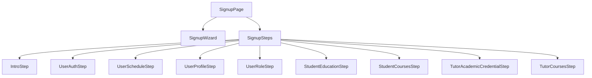

## View Details

### SignupPage
The `SignupPage` serves as the entry point for the signup feature. It manages the overall flow of the signup process, including navigation between steps and form validation. The page uses the `SignupWizard` to display dialogues and animations, creating an engaging user experience.

### Signup Steps
The signup process is divided into multiple steps, each represented by a `SignupStep` object. These steps include:
- **IntroStep**: Introduces the user to the signup process.
- **UserAuthStep**: Collects authentication details, such as email and password.
- **UserScheduleStep**: Gathers the user's availability.
- **UserProfileStep**: Collects profile information, such as name and profile picture.
- **UserRoleStep**: Allows the user to select their role (e.g., tutor or student).
- **StudentEducationStep**: Collects educational details for students.
- **StudentCoursesStep**: Allows students to select their courses.
- **TutorAcademicCredentialStep**: Collects academic credentials for tutors.
- **TutorCoursesStep**: Allows tutors to select the courses they can teach.

### Sequence Diagram

#### Signup Flow
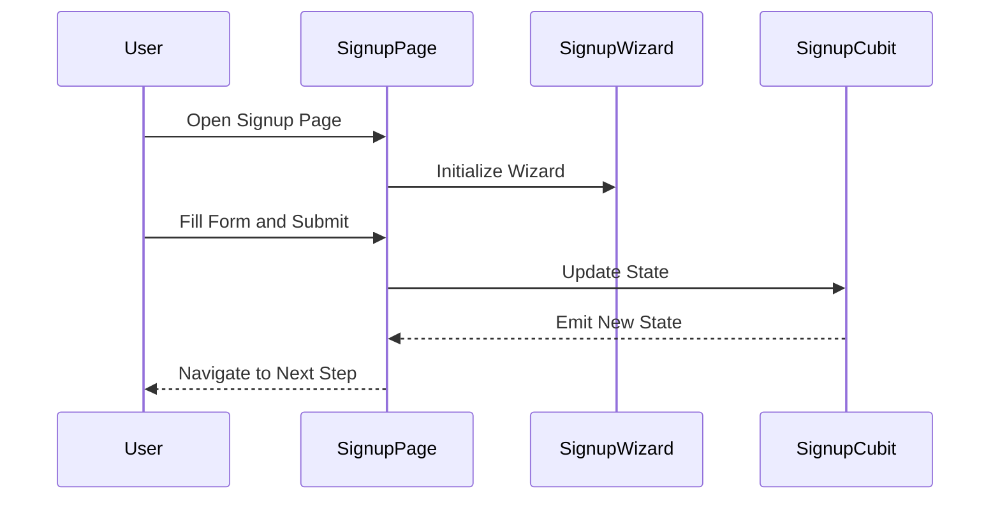

### General Structure
Each step in the signup process is defined by a `SignupStep` object, which includes:
- **Title**: The title of the step.
- **Dialogue**: The dialogue to be displayed during the step.
- **ShowIf**: A predicate function to determine if the step should be shown.
- **Builder**: A function to build the UI for the step.
- **Callback**: A function to handle the data submitted in the step.

This modular structure allows for easy customization and extension of the signup process.

# Signup Components

## Overview
This document provides an overview of the components (or widgets) used in the signup feature.  These widgets are modular components that enhance the user experience and simplify the implementation of the signup process.

## Widgets Details

### SignupWizard 

The `SignupWizard` component guides the user through each signup step by animating a series of instructional messages with a typewriter effect. Simultaneously, a Rive animation (e.g., a book asset) plays when the `say()` method is invoked or when the widget loads. This conversational approach emulates the guided experience found in apps like Duolingo and can be extracted as a standalone package for use in other projects.

##### Component Diagram of SignupWizard

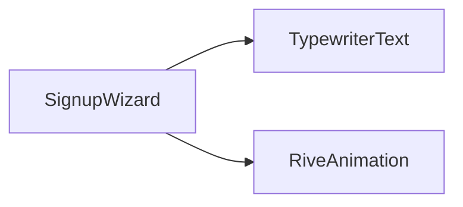

##### Sequence Diagram of SignupWizard

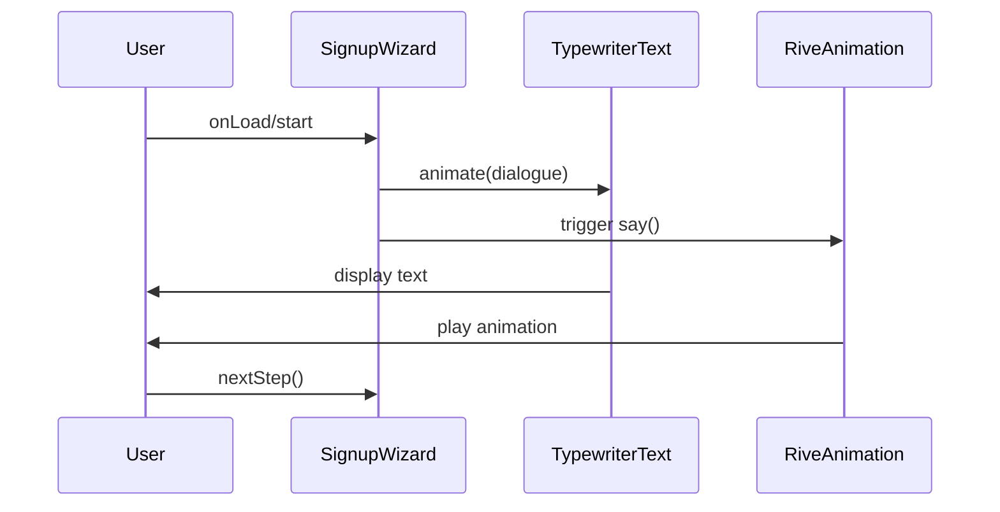

### SignupProgressBar

The `SignupProgressBar` visually represents the user's progress through the signup flow. It takes the total number of steps and the current step index as inputs, then animates the progress bar smoothly whenever the index changes, providing clear visual feedback to the user.

##### Component Diagram of SignProgressBar

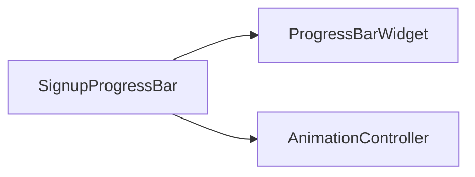

##### Sequence Diagram of SignupProgressBar

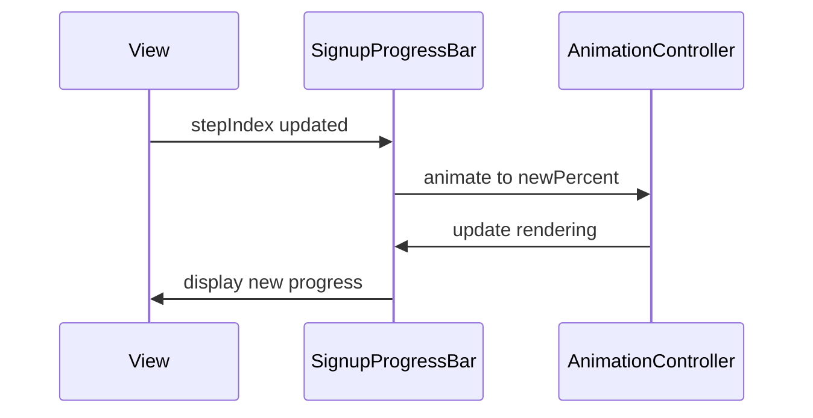

### SignupSwitcher

The `SignupSwitcher` handles transitions between step widgets using Flutter's `AnimatedSwitcher`. By keying each container to the current step index, it detects changes and animates the transition from the old step to the new one. While page-based animations might simplify this, using `AnimatedSwitcher` gives precise control over entry and exit effects for each step.

##### Component Diagram of SignupSwitcher

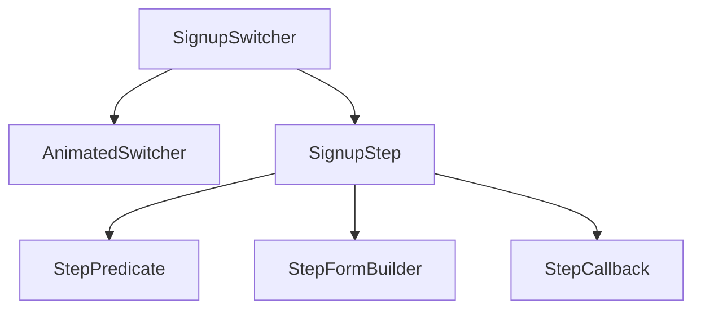

##### Sequence Diagram when the SignupStep Changes.

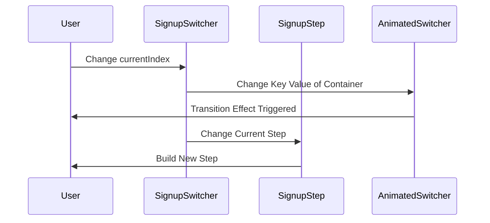

## SignupStep

The `SignupStep` class represents a single step in the signup process, encapsulating title, dialogue, conditional display logic, UI building, and data handling.

##### Class Diagram of SignupStep

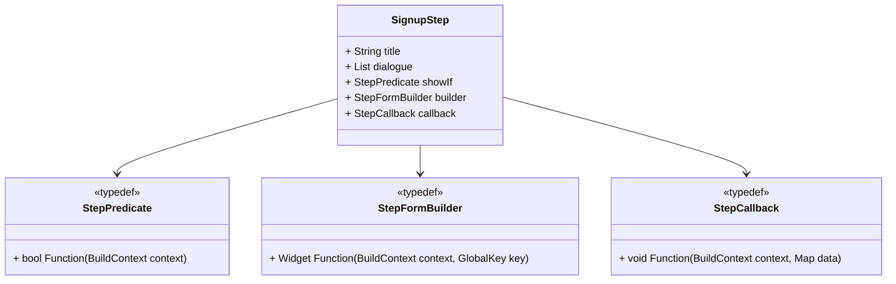

The `SignupStep` class contains the following properties:

##### 1. `String` title

Title is a string that represents the title of the step. Displayed in the AppBar, it provides a constant label for the current step as the animated dialogue changes.

##### 2. `List<String>` dialogue

The `dialogue` list contains the messages shown by `SignupWizard`. Each string is displayed with a typewriter animation to guide the user through the step.

##### 3. `StepPredicate` showIf

The `showIf` predicate determines whether the step should be shown, based on the current `BuildContext`. This allows conditional steps that adapt to user data or previous responses.

##### 4. `StepFormBuilder` builder

The `builder` function constructs the UI for this step, typically returning a form widget. It receives a `BuildContext` and a `GlobalKey<FormBuilderState>` so external controls (e.g., Next button) can trigger validation.

##### 5. `StepCallback` callback

After form validation, the `callback` is called with the `BuildContext` and a `Map<String, dynamic>` containing the user's input. This allows custom handling of the data, such as saving to a repository or updating application state.

## Putting It All Together

By combining `SignupWizard`, `SignupProgressBar`, `SignupSwitcher`, and `SignupStep`, you can build a complete, interactive signup flow:

```dart
SignupView(
  steps: [
    SignupStep(
      title: 'Create Account',
      dialogue: ['Welcome!', 'Let\'s create your account.'],
      showIf: (_) => true,
      builder: (context, key) => EmailForm(key: key),
      callback: (context, data) { /* save email */ },
    ),
    // add additional steps...
  ],
);
```

This setup handles animations, progress tracking, and data flow, offering a modular solution for onboarding experiences.