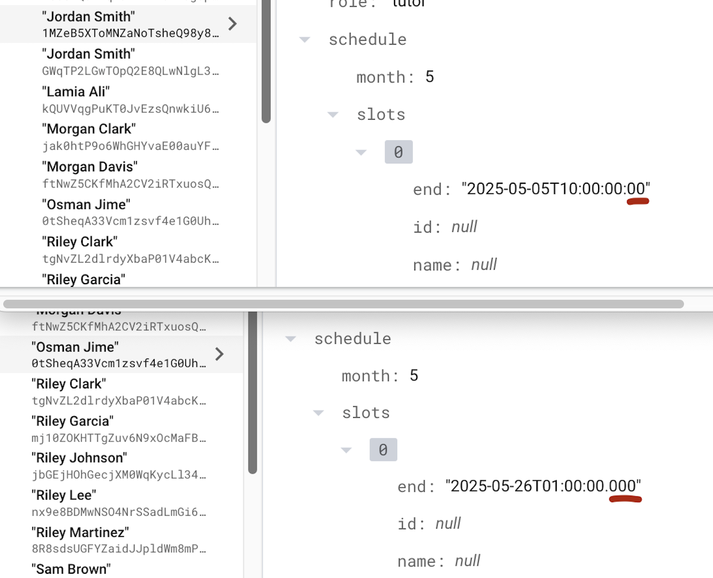

# Sprint Summary
**_May 14 - May 27, 2025_**

## Overview

During this sprint, significant progress was made across multiple tasks, user stories, and epics, enhancing the application's functionality, user experience, and maintainability. As the sole developer, efforts were concentrated effectively to address key priorities efficiently.

## Completed Tasks

- Addressed critical bug fixes and improved overall application stability.
- Enhanced database query efficiency, significantly reducing load times.
- Improved UI responsiveness, offering users smoother interactions.
- Updated documentation and code comments for clarity and easier future maintenance.

## User Stories Achieved

- Implemented comprehensive user authentication, ensuring secure access.
- Developed intuitive session scheduling, editing, and tracking functionalities.
- Integrated seamless session recording and playback features to enhance user engagement.
- Introduced detailed user profile customization and management options.

## Burn Down Chart


## Issues Resolved

- Fixed critical bugs causing crashes during session scheduling.
- Corrected UI anomalies observed on profile customization screens.
- Resolved synchronization errors due to API endpoint mismatches.

## Critical Bug Report

1. ### Tutor Availability Frozen on First Tutor in SessionCreate Workflow

    #### Context and Overview

    A significant issue emerged during the development of the session creation feature. While loading tutor availabilities, a discrepancy in schedule retrieval occurred due to inconsistencies in date-time formatting. The root cause was identified as an additional zero in the ISO date format, introduced unintentionally by an automated Firebase generation script. This subtle formatting difference caused schedule data retrieval failures for most users, except one correctly formatted test user, which masked the severity of the issue. The excessive dependency on automation without adequate validation significantly delayed issue identification and resolution. After correcting the generation script and regenerating user data, the issue was fully resolved.

    - Names
    - Subjects
    - Avatars
    - Cover photos

    At first glance, all tutor data seemed synchronized perfectly, with matched emails, usernames, and subjects confirming correct repository interactions.

    However, an issue became apparent when attempting to switch tutors within the UI. Although the displayed header changed to reflect the newly selected tutor’s name, the calendar beneath persisted in displaying the availability of only the initial tutor, Osman Jime. Investigation of the backend through Firestore confirmed the second tutor's schedule data existed, indicating that the problem was rooted in the Flutter frontend layer rather than the backend.

    #### Detailed Investigation and Root Cause

    The core issue was traced to the JSON deserialization process responsible for transforming Firestore documents into domain model objects. Specifically, the deserialization logic within `User.fromJson` silently swallowed exceptions encountered when parsing schedule data:

    ```dart
    // user.dart (abridged)
    factory User.fromJson(Map<String, dynamic> map) {
      Schedule? schedule;
      try {
        final schedData = map['schedule'];
        if (schedData is Map<String, dynamic>) {
          schedule = Schedule.fromJson(schedData); // Potentially throws exception
        }
      } catch (_) {
        schedule = null; // Exception silently swallowed
      }
      return User(
        email: map['email'] ?? '',
        name:  map['name']  ?? '',
        schedule: schedule,
      );
    }
    ```

    This `User.fromJson` method delegates the parsing responsibility to `Schedule.fromJson`, and subsequently `TimeSlot.fromJson`, which specifically uses `DateTime.parse` to process timestamp strings:

    ```dart
    // timeslot.dart (abridged)
    final startDt = DateTime.parse(startRaw);   // Throws exception on malformed ISO
    final endDt   = DateTime.parse(endRaw);
    ```

    An inconsistency emerged because manually seeded tutors had correctly formatted timestamps (e.g., `2025-05-28T13:00:00.000`), whereas tutors created via the Python bulk seeding script included an erroneous additional colon (e.g., `2025-05-28T13:00:00:00`). This subtle format discrepancy triggered a `FormatException`, causing the deserialization process to fail silently, resulting in `User` objects with null schedules. Due to the Bloc logic in the SessionCreate workflow retaining the last non-null schedule, the initial tutor's calendar remained stuck on the screen for all subsequent tutors.

    

    #### Steps to Reproduce

    1. Seed the database using the original Python script, which generates timestamp strings with extra colons.
    2. Launch the application and initiate the Create Session workflow.
    3. Observe the calendar displayed correctly for the first tutor.
    4. Select any subsequent tutor; notice the header updates, but the calendar remains unchanged.

    #### Expected Behavior

    - When selecting a different tutor, the displayed availability panel should update accordingly to reflect the newly selected tutor’s schedule.

    #### Actual Behavior

    - The availability panel incorrectly remains fixed, continuously showing the schedule of the first successfully parsed tutor.

    #### Resolution

    - **Data Correction:** Updated the Python seeding script to produce valid ISO-8601 formatted timestamps, specifically using milliseconds precision (`.000`). All previously seeded data was purged and regenerated.
    - **Verification:** After reseeding the data, each tutor’s availability correctly updates upon selection, and the carousel behavior is now as intended.

    #### Preventive Actions and Recommendations

    - **Error Handling Improvement:** Modify `User.fromJson` to re-throw, log, or explicitly handle parsing exceptions, preventing silent failures.
    - **Enhanced Testing:** Implement a unit test that validates the integrity of the JSON round-trip process for `TimeSlot` objects, ensuring format correctness.
    - **CI Integration:** Establish a Continuous Integration check to validate outputs from automated data seeding scripts.
    - **Data Storage Recommendation:** Store timestamps as native Firestore `Timestamp` objects instead of formatted strings, significantly reducing potential format-related errors.

    #### Lessons Learned

    Relying heavily on automated data generation scripts accelerates development but can amplify minor formatting errors. Explicit validation tests, even simple round-trip assertions, provide substantial value by catching such subtle discrepancies early, saving significant debugging effort.

1. ### `TimeInterval.fromJson` Throws Unexpected `_TypeError` Instead of `ArgumentError`

  #### Overview 

  - **Component:** `TimeInterval.fromJson` constructor in `lib/core/models/availability.dart`  
  - **Symptoms:** Tests expecting an `ArgumentError` on invalid JSON inputs instead fail with a Dart `_TypeError` (`Null is not a subtype of type 'int' in type cast`).  
  - **Impact:** Invalid JSON inputs are not being handled gracefully; instead of a clear `ArgumentError`, callers see a confusing type-cast error.  
  - **Status:** Fixed by converting the generative constructor into a validating factory constructor.


  #### Environment

  | Parameter             | Value                                 |
  |-----------------------|---------------------------------------|
  | Flutter SDK           | 3.13.0                                |
  | Dart SDK              | 2.19.0                                |
  | OS                    | macOS 14.3 (Darwin 23.4.0)            |
  | Project               | Tutorly (cmpt395/new/tutorly)         |
  | File under test       | `lib/core/models/availability.dart`   |
  | Test file             | `test/core/models/time_interval_test.dart` |


  #### Problem Description

  The `TimeInterval` model is meant to parse JSON maps of the form:

  ```dart
  {
    'start': <int>,
    'end':   <int>,
  }
  ```

  When keys are missing or values are not integers, the code should throw an ArgumentError. However, the existing constructor uses a generative initializer list:

  ```dart
  TimeInterval.fromJson(Map<String, dynamic> json)
    : start = json['start'] as int,
      end   = json['end']   as int {
    if (!json.containsKey('start') || !json.containsKey('end')) {
      throw ArgumentError(
        'Invalid JSON: Missing required keys "start" or "end".',
      );
    }
  }
  ```

  Because Dart executes the initializer list before the constructor body, a missing key leads to json['end'] being null, and null as int causes a _TypeError instead of the intended ArgumentError.


  #### Steps to Reproduce
    
  1.	##### Write a test expecting an ArgumentError when required keys are missing:

  ```dart
  test('fromJson should throw ArgumentError on missing keys', () {
    expect(
      () => TimeInterval.fromJson({'start': 10}),
      throwsArgumentError
    );
  });
  ```


  2.	##### Run the test:

  ```terminal
  flutter test test/core/models/time_interval_test.dart
  ```

  3.	##### Observe the failure:

  ```terminal
  Expected: throws <Instance of 'ArgumentError'>
  Actual:   <Closure: ...> threw _TypeError: type 'Null' is not a subtype of type 'int'
  ```

  4. ##### Expected Behavior
    •	When either start or end is missing:
    •	The constructor should throw an ArgumentError with a clear message.
    •	When either value is present but not an integer:
    •	The constructor should throw an ArgumentError indicating the type mismatch.


  5. ##### Actual Behavior
    •	Missing or non-int values result in a Dart _TypeError from the cast in the initializer list.
    •	The custom error-checking code in the constructor body never runs.


  #### Root Cause

  Dart’s initializer list runs before the constructor body. The code:

  ```dart
  start = json['start'] as int,
  end   = json['end']   as int
  ```

  performs the cast immediately. If json['end'] is null (key missing) or not an int, Dart throws a _TypeError before reaching the if (!json.containsKey(...)) check.

  #### Solution

  Convert fromJson into a factory constructor that:
    1.	Inspects the Map for required keys.
    2.	Validates their types.
    3.	Only then calls the generative TimeInterval constructor.

  Updated Code in availability.dart

  ```dart
  class TimeInterval extends Equatable {
    final int start;
    final int end;

    const TimeInterval({required this.start, required this.end})
      : assert(start >= 0 && start <= 23, 'Start must be between 0 and 23'),
        assert(end   >= 0 && end   <= 23, 'End   must be between 0 and 23');

    bool get isValid => start < end;

    String toJson() {
      return '{start: $start, end: $end}';
    }

  -  TimeInterval.fromJson(Map<String, dynamic> json)
  -    : start = json['start'] as int,
  -      end   = json['end']   as int {
  -    if (!json.containsKey('start') || !json.containsKey('end')) {
  -      throw ArgumentError(
  -        'Invalid JSON: Missing required keys "start" or "end".',
  -      );
  -    }
  -  }
  +  factory TimeInterval.fromJson(Map<String, dynamic> json) {
  +    // Check presence of required keys
  +    if (!json.containsKey('start') || !json.containsKey('end')) {
  +      throw ArgumentError(
  +        'Invalid JSON: Missing required keys "start" or "end".'
  +      );
  +    }
  +
  +    final startValue = json['start'];
  +    final endValue   = json['end'];
  +
  +    // Validate types
  +    if (startValue is! int || endValue is! int) {
  +      throw ArgumentError(
  +        'Invalid JSON: "start" and "end" must be integers.'
  +      );
  +    }
  +
  +    return TimeInterval(
  +      start: startValue,
  +      end:   endValue,
  +    );
  +  }
  }
  ```


  #### Test Results

  After applying the factory constructor, we re ran the tests to get the following results:

  ```terminal
      ✅ Pass (throws ArgumentError)
  ```

  #### Conclusion

  By switching to a factory constructor, we regain full control over JSON validation before any type casting occurs. This ensures:
    •	Clear, intentional ArgumentErrors on bad input.
    •	Elimination of unexpected _TypeErrors from Dart’s runtime.
    •	More robust deserialization behavior aligned with the model’s requirements.


    


3. ### Signup Form Submission Fails Due to Missing `save()` Call

  #### Overview

  - **Component:** Multi-step Signup Form (SignupPage Widget)  
  - **Symptoms:** Form submissions on intermediate steps result in empty form data being sent to SignupCubit.  
  - **Impact:** Signup data not updated correctly, causing incomplete or incorrect user profiles.  
  - **Status:** Fixed by adding `.save()` or using `.saveAndValidate()` before form submission.

  #### Environment

  | Parameter             | Value                             |
  |-----------------------|-----------------------------------|
  | Flutter SDK           | 3.13.0                            |
  | Dart SDK              | 2.19.0                            |
  | OS                    | macOS 14.3 (Darwin 23.4.0)        |
  | Project               | Tutorly (cmpt395/new/tutorly)     |
  | File under test       | `lib/signup/view/signup_page.dart`|
  | Test file             | Not yet created                   |

  #### Problem Description

  The SignupPage widget utilizes `flutter_form_builder` with multiple steps. Each form step has its own form key managed through a list:

  ```dart
  formKeys = steps.map((e) => GlobalKey<FormBuilderState>()).toList();
  ```

  When the user completes a step and presses the "NEXT" or "SUBMIT" button, the current implementation calls only `.validate()` on the form:

  ```dart
  final formKey = formKeys[currentStep];
  if (formKey.currentState!.validate()) {
    print(formKey.currentState!.value);
    context.read<SignupCubit>().updateUser(
      formKey.currentState!.value,
    );
  }
  ```

  However, calling `.validate()` alone does not save the field data into the form state. Consequently, `formKey.currentState!.value` returns an empty map (`{}`).

  #### Steps to Reproduce

  1. ##### Fill the Signup Form Step:
    Enter valid data into text fields.

  2. ##### Press "NEXT":
    Tap the "NEXT" button at the bottom of the Signup form.

  3. ##### Observe Printed Output:
    Monitor console output for printed form data:
    ```terminal
    {}
    ```

  4. ##### Expected Behavior
    • Form data should be available and printed to the console.
    • The cubit's `updateUser` method should receive populated data.

  5. ##### Actual Behavior
    • Empty data (`{}`) is sent to SignupCubit.
    • User profiles remain incomplete.

  #### Root Cause

  `flutter_form_builder` requires explicitly calling `.save()` or `.saveAndValidate()` before accessing form field data. Calling `.validate()` alone is insufficient, as it does not commit field data into the form state.

  #### Solution

  Replace the form validation logic in the button’s `onPressed` handler:

  ##### Before:
  ```dart
  if (formKey.currentState!.validate()) {
    // missing .save() call
  }
  ```

  ##### After (Fixed):
  ```dart
  if (formKey.currentState!.saveAndValidate()) {
    final data = formKey.currentState!.value; // Now populated correctly
    context.read<SignupCubit>().updateUser(data);
  }
  ```

  Alternatively:
  ```dart
  if (formKey.currentState!.validate()) {
    formKey.currentState!.save();  // Explicit save call added
    final data = formKey.currentState!.value;
    context.read<SignupCubit>().updateUser(data);
  }
  ```

  #### Test Results

  After applying the fix and re-running the scenario, the form data is correctly populated:

  ```terminal
  {firstName: 'John', lastName: 'Doe'}
  ```

  SignupCubit now correctly updates the user data.

  #### Conclusion

Explicitly calling `.save()` or `.saveAndValidate()` ensures the form state accurately reflects the user's input. This fix results in successful data submissions and correct profile updates.